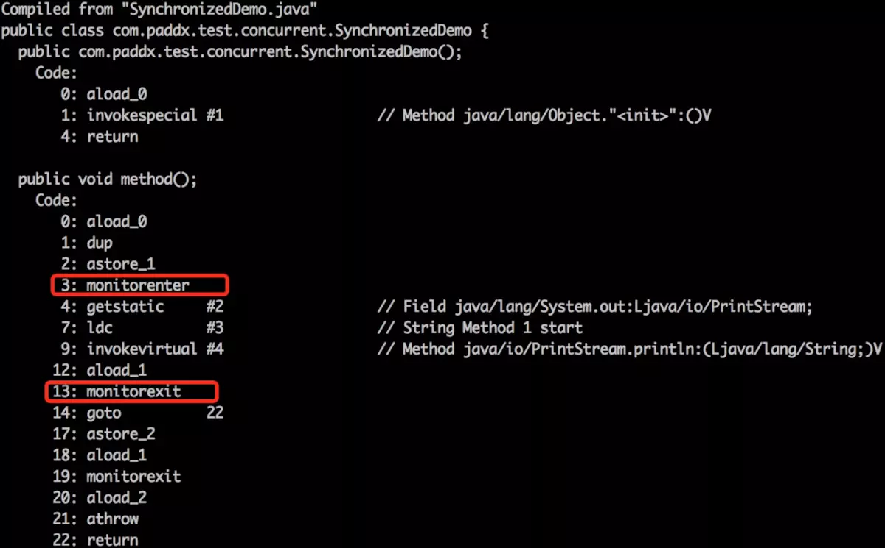

[toc]


# 一、volatile

volatile 是轻量级的 synchronized，它保证了共享变量的 “可见性”

> - 可见性：当一个线程修改一个共享变量时，另外一个线程能读到这个修改的值
> - 轻量：如果volatile变量修饰符使用恰当的话，它比synchronized的使用和执行成本更低，因为它不会引起线程上下文的切换和调度


Java代码：

```
instance = new Singleton(); 	// instance是volatile变量
```

转变成汇编代码，如下：

```b
0x01a3de1d: movb $0×0,0×1104800(%esi);0x01a3de24: lock addl $0×0,(%esp);
```

volatile 修饰的共享变量进行写操作时会多出第二行汇编代码，通过查 IA-32 架构软件开发者手册可知，Lock前缀的指令在多核处理器下会引发了两件事：

> （1）**将当前处理器缓存行的数据写回到系统内存**。
>
> （2）**这个写回内存的操作会使在其他CPU里缓存了该内存地址的数据无效**。


为了提高处理速度，处理器不直接和内存进行通信，而是先将系统内存的数据读到内部缓存（L1，L2或其他）后再进行操作，但操作完不知道何时会写到内存。**如果对声明了volatile的变量进行写操作，JVM就会向处理器发送一条Lock前缀的指令，将这个变量所在缓存行的数据写回到系统内存**。但是，就算写回到内存，如果其他处理器缓存的值还是旧的，再执行计算操作就会有问题。所以，**在多处理器下，为了保证各个处理器的缓存是一致的，就会实现缓存一致性协议，每个处理器通过嗅探在总线上传播的数据来检查自己缓存的值是不是过期了，当处理器发现自己缓存行对应的内存地址被修改，就会将当前处理器的缓存行设置成无效状态，当处理器对这个数据进行修改操作的时候，会重新从系统内存中把数据读到处理器缓存里**。 （可参见： Javan内存模型定义的8种内存间交互操作）


# 二、Synchronized 

>参见：[啃碎并发（七）：深入分析Synchronized原理](https://www.jianshu.com/p/e62fa839aa41)


 在 JDK1.5 之前 synchronized 是一个重量级锁，但是，随着 Java SE 1.6 对 synchronized 进行了各种优化之后，有些情况下它就并不那么重了

## 1. Synchronized的用法

> - 对于静态同步方法，锁是当前类的Class对象。
> - 对于普通同步方法，锁是当前实例对象。
> - 对于同步方法块，锁是Synchonized括号里配置的对象。


## 2. Synchronized的底层原理

### 2.1 同步代码块

访问同步代码块时，synchronized 会被编译为  `monitorenter` 、 `monitorexit` 指令

 ```java
package com.paddx.test.concurrent;

public class SynchronizedDemo {
    public void method() {
        synchronized (this) {
            System.out.println("Method 1 start");
        }
    }
}
 ```

  


> monitorenter 指令是在编译后插入到同步代码块的开始位置，而 monitorexit 是插入到方法结束处和异常处，JVM 要保证每个 monitorenter 必须有对应的 monitorexit 与之配对。任何对象都有一个 monitor 与之关联，当一个 monitor 被持有后，它将处于锁定状态。线程执行到 monitorenter 指令时，将会尝试获取对象所对应的 monitor 的所有权，即尝试获得对象的锁。


### 2.2 同步方法

访问同步方法时， synchronized 会被翻译成  **ACC_SYNCHRONIZED**  标志

```java
package com.paddx.test.concurrent;

public class SynchronizedMethod {
    public synchronized void method() {
        System.out.println("Hello World!");
    }
}
```

  


> 当方法调用时，**调用指令将会检查方法的 ACC_SYNCHRONIZED 访问标志是否被设置**，如果设置了，**执行线程将先获取 monitor**，获取成功之后才能执行方法体，**方法执行完后再释放monitor**。在方法执行期间，其他任何线程都无法再获得同一个monitor对象。


两种同步方式本质上没有区别，只是方法的同步是一种隐式的方式来实现，无需通过字节码来完成。**两个指令的执行是JVM通过调用操作系统的互斥原语mutex来实现，被阻塞的线程会被挂起、等待重新调度**，会导致“用户态和内核态”两个态之间来回切换，对性能有较大影响。


## 3.对象头结构


## 4.锁升级

- Java SE 1.6 为了减少获得锁和释放锁带来的性能消耗，对 synchronized 进行优化，引入了“偏向锁”和“轻量级锁”。

- 在 Java SE 1.6 中，锁一共有4种状态，级别从低到高依次是：无锁状态、偏向锁状态、轻量级锁状态和重量级锁状态。

- 锁可以升级，但不能降级：

  > （1）最开始，监视器锁为无锁状态
  >
  > （2）此时线程 A 进入，监视器锁升级为偏向锁（当只有一个线程时，为偏向锁）
  >
  > （3）接着线程 B 过来竞争锁，偏向锁升级为轻量级锁状态（再来一个线程就升级为偏向锁）
  >
  > （4）然后当线程B自旋次数达到10次，线程B就会挂起，进入阻塞状态，此时轻量级锁升级为重量级锁（自旋次数达到阈值，就会升级为重量级锁）


### 4.1 偏向锁

> 适用于只有一个线程访问同步块

HotSpot 的作者经过研究发现，大多数情况下，锁不仅不存在多线程竞争，而且总是由同一线程多次获得，为了让线程获得锁的代价更低而引入了偏向锁。

（1）获取锁

最开始监视器锁为无锁状态，此时一个线程A来访问同步块时，首先会测试 **锁对象头的 Mark Word 里是否存储着当前线程ID**

- 如果测试成功，表示线程A已经获得了锁
- 如果测试失败，则需要再测试 **Mark Word 中偏向锁的标识是否设置成1**（表示当前是偏向锁）
  - 如果为 0 ，表示无锁状态，则使用CAS在 **对象头的 MarkWord** 和 **栈帧中的锁记录（Lock Record）** 里存储当前线程ID，存储成功即代表成功获取锁
  - 如果为 1，表示已经有线程B获取了偏向锁，此时测试获取了偏向锁的线程是否还在执行任务
    - 若是，表示发生竞争，锁升级为轻量级锁
    - 若否，则使用CAS在修改**对象头的 MarkWord** 和 **栈帧中的锁记录（Lock Record）** 里的线程ID为当前线程ID


（2）释放锁


> - 栈帧中的锁记录：存储线程ID
> - 对象头的MarkWord：存储线程ID


### 4.2 轻量级锁


加锁：

> （1）创建栈帧中锁记录（Displaced Mark Word）空间
>
> （2）将对象头MarkWord复制到锁记录
>
> （3）线程 CAS 将对象头的MarkWord替换为指向锁记录的指针


### 4.3 锁的优缺点对比


# 二、synchronized

synchronized 作用于实例方法时，是锁对象

synchronized 作用于静态方法时，是锁Class


## 1.同步原理

（1）访问同步代码块时，synchronized 会被编译为  **monitorenter** 、 **monitorexit** 指令

 ```java
package com.paddx.test.concurrent;

public class SynchronizedDemo {
    public void method() {
        synchronized (this) {
            System.out.println("Method 1 start");
        }
    }
}
 ```


（2）访问同步方法时， synchronized 会被翻译成  **ACC_SYNCHRONIZED**  标志

```java
package com.paddx.test.concurrent;

public class SynchronizedMethod {
    public synchronized void method() {
        System.out.println("Hello World!");
    }
}
```

  


## 2.锁升级过程

最开始锁时无锁状态，这时一个线程进入同步块，将其线程ID写入锁对象头，升级为偏向锁。

偏向锁时，只要一有竞争，就会升级为轻量级锁。也就是说只要这时有另一个线程尝试进入同步块，就会升级为轻量级锁。

轻量级锁时，如果一个线程自旋次数达到阈值（默认10次），线程就会挂起，也就升级为重量级锁。


## 3.锁存储

偏向锁:

> - 栈帧中的锁记录：存储线程ID
>
> - 对象头的MarkWord：存储线程ID


轻量级锁：

加锁：

> （1）创建栈帧中锁记录（Displaced Mark Word）空间
>
> （2）将对象头MarkWord复制到锁记录
>
> （3）线程 CAS 将对象头的MarkWord替换为指向锁记录的指针


# 参考资料

> - [啃碎并发（七）：深入分析Synchronized原理](https://www.jianshu.com/p/e62fa839aa41)


