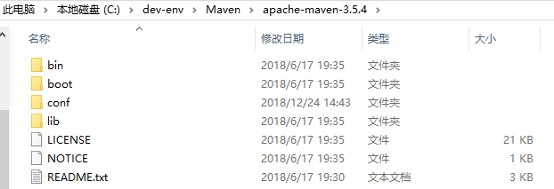

[TOC]


# 一、简介

Maven主要服务于基于Java平台的**项目构建**、**依赖管理**和**项目信息管理**


- 何为构建

> 除了编写源代码，我们每天有相当一部分时间花在了**编译、运行单元测试、生成文档、打包和部署**等烦琐且不起眼的工作上，这就是**构建**。


# 二、安装Maven

## 1.Windows下安装Maven

### 1.1 检查JDK安装

执行如下命令，检查JDK的安装情况

> echo  %JAVA_HOME%
>
> java -version


### 1.2 maven安装

（1）去官网下载maven，解压，

（2）然后设置环境变量（建议设置用户环境变量）

```properties
M2_HOME=C:\dev-env\Maven\apache-maven-3.5.4
PATH=%M2_HOME%\bin
```

（3）验证

> echo  %M2_HOME%
>
> mvn -v


## 2.Linux下安装Maven

### 2.1 下载

前往[官网](http://maven.apache.org/download.cgi)下载`.tar.gz`格式的压缩包

### 2.2 解压

```bash
# 创建安装目录
sudo mkdir /usr/local/maven/

# 解压至安装目录
sudo tar -zxvf apache-maven-3.6.2-bin.tar.gz -C /usr/local/maven/
```


### 2.3 设置环境变量

编辑文件`/etc/profile`

```bash
sudo vim /etc/profile
```

添加文件末尾追加 JDK环境变量

```properties
export MAVEN_HOME=/usr/local/maven/apache-maven-3.6.2
export PATH=$MAVEN_HOME/bin:$PATH
```

使环境变量生效

```
source /etc/profile
```


# 三、基础知识

## 1.安装目录分析





| 目录 | 分析                                                         |
| ---- | ------------------------------------------------------------ |
| bin  | （1）该目录包含了mvn运行的脚本，（2）这些脚本用来配置Java命令，准备好classpath和相关的Java系统属性，然后执行Java命令。 |
| boot | 包含一个类加载器框架：`plexus-classworlds-2.5.2.jar`         |
| conf | （1）包含一个全局配置文件 `settings.xml` ，（2）一般情况下，推荐将该文件复制到  `~/.m2/` 目录下，然后修改该文件，在用户范围定制Maven的行为。 |
| lib  | 包含所有maven运行时需要的Java类库                            |


## 2.设置HTTP代理

若想使Maven通过代理服务器来下载jar包，则需要为Maven配置HTTP代理

### 2.1 确认代理服务器畅通

> telnet  ip  端口

如果telnet连接正确，则输入ctrl+］，然后q，回车，退出即可。


### 2.2 修改用户配置

检查完毕之后，编辑 `~/.m2/settings.xml` 文件（如果没有该文件，则复制 `＄M2_HOME/conf/settings.xml` ）。

添加代理配置如下：

```xml
<settings >
...
  <proxies>        
    <proxy>
      <id>my-proxy</id>
      <active>true</active>
      <protocol>http</protocol>
      <host>192.168.12.107</host>
      <port>3128</port>
      <!-- 
      <username>proxyuser</username>
      <password>proxypass</password>     
      <nonProxyHosts>local.net|some.host.com</nonProxyHosts>
      -->
    </proxy>
  </proxies>
...
</settings>
```


> - 当代理服务需要认证时，就需要配置username和password。
>
> - nonProxyHost元素用来指定哪些主机名不需要代理，可以使用“|”符号来分隔多个主机名。且可使用通配符 *


# 四、最佳实践

## 1.设置MAVEN_OPTS环境变量

运行mvn命令实际上是执行了Java命令，通过 MAVEN_OPTS 可设置 jvm参数。

> 通常需要设置MAVEN_OPTS的值为-Xms128m-Xmx512m，
>
> 因为Java默认的最大可用内存往往不能够满足Maven运行的需要，比如在项目较大时，使用Maven生成项目站点需要占用大量的内存，如果没有该配置，则很容易得到java.lang.OutOfMemeoryError。因此，一开始就配置该变量是推荐的做法。


## 2.配置用户范围settings.xml


| 配置文件                      | 适用范围 | 描述                                         |
| ----------------------------- | -------- | -------------------------------------------- |
| `＄M2_HOME/conf/settings.xml` | 全局范围 | 整台机器上的所有用户都会直接受到该配置的影响 |
| `~/.m2/settings.xml`          | 用户范围 | 只有当前用户才会受到该配置的影响             |


推荐使用用户范围的settings.xml，主要是：

> - 避免无意识地影响到系统中的其他用户
> - 方便Maven版本升级


## 3.不要使用IDE内嵌的Maven

原因：

> - 版本新，可能不稳定
> - 与命令行的maven不一致


因此，应该在IDE中配置Maven插件时使用与命令行一致的Maven。


