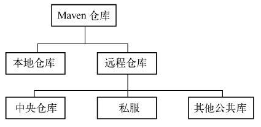

[TOC]


# 一、前言


# 二、仓库

## 1.什么是Maven仓库

在Maven世界中，任何一个依赖、插件或者项目构建的输出，都可以称为**构件**。

 Maven可以在某个位置统一存储所有 Maven项目共享的构件，这个统一的位置就是**仓库**。实际的 Maven项目将不再各自存储其依赖文件，它们只需要声明这些依赖的坐标，在需要的时候， Maven会自动根据坐标找到仓库中的构件，并使用它们。


## 2.仓库的布局

任何一个构件都有其唯一的坐标，根据这个坐标可以定义其在仓库中的唯一存储路径，这便是Maven的仓库布局方式。

该路径与坐标的大致对应关系为:`groupId / artifactId / version / artifactId - version.packaging`。


## 3.仓库的分类

### 3.1 依赖搜索机制




对于Maven来说，仓库只分为两类：本地仓库和远程仓库。

依赖搜索机制：

> 当 Maven根据坐标寻找构件的时候，
>
> - 它首先会查看本地仓库，如果本地仓库存在此构件，则直接使用；
> - 如果本地仓库不存在此构件，或者需要查看是否有更新的构件版本， Maven就会去远程仓库查找，发现需要的构件之后，下载到本地仓库再使用。
> - 如果本地仓库和远程仓库都没有需要的构件， Maven就会报错。


### 3.2 本地仓库

一个构件只有在本地仓库中之后，才能由其他 Maven 项目使用。

那么构件如何进入到本地仓库中呢？

- 远程下载：最常见的是依赖Maven从远程仓库下载到本地仓库中。
- 本地安装：还有一种常见的情况是，将本地项目的构件安装到 Maven仓库中。


### 3.3 远程仓库

对于Maven来说，每个用户只有一个本地仓库，但可以配置访问很多远程仓库。

#### 3.3.1 中央仓库

中央仓库是Maven核心自带的远程仓库，它包含了绝大部分开源的构件。在默认配置下，当本地仓库没有 Maven需要的构件的时候，它就会尝试从中央仓库下载。


> - 由于最原始的本地仓库是空的，Maven必须知道至少一个可用的远程仓库，才能在执行 Maven命令的时候下载到需要的构件。中央仓库就是这样一个默认的远程仓库， Maven的安装文件自带了中央仓库的配置。
>
> - 在＄M2_HOME/lib/ maven-model-builder-3.0. jar 中 org/apache/maven/model/pom-4.0.0.xml 文件中有如下配置（即中央仓库的配置）：
>
>     ```xml
>       <repositories>
>         <repository>
>           <id>central</id>
>           <name>Central Repository</name>
>           <url>https://repo.maven.apache.org/maven2</url>
>           <layout>default</layout>
>           <snapshots>
>             <enabled>false</enabled>
>           </snapshots>
>         </repository>
>       </repositories>
>     ```
>


#### 3.3.2 私服

私服是一种特殊的远程仓库，它是架设在局域网内的仓库服务，私服代理广域网上的远程仓库，供局域网内的
Maven用户使用。

- 当 Maven需要下载构件的时候，它从私服请求，如果私服上不存在该构件，则从外部的远程仓库下载，缓存在私服上之后，再为 Maven的下载请求提供服务。

- 此外，一些无法从外部仓库下载到的构件也能从本地上传到私服上供大家使用，


## 4.远程仓库的配置

### 4.1 远程仓库的配置

```xml
  <repositories>
    <repository>
      <id>jboss</id>
      <name>Jboss Repository</name>
      <url>http://repository.jboss.com/maven2</url>
      <releases>
        <enabled>true</enabled>
      </releases>
      <snapshots>
        <enabled>false</enabled>
      </snapshots>
    </repository>
    <layout>default</layout>
  </repositories>
```


在repositories元素下，可以使用 repository子元素声明一个或者多个远程仓库。

- id : 仓库的唯一标识。任何一个仓库声明的id必须是唯一的，尤其需要注意的是， Maven自带的中央仓库使用的 id为 central，如果其他的仓库声明也使用该 id，就会覆盖中央仓库的配置。
- url : 指定仓库的地址。
- releases ： 若enable值为true，则表示开启此仓库的 release 版本的下载支持。
- snapshots ：  若enable值为true，则表示开启此仓库的 snapshot 版本的下载支持。
- layout ： 若为default，则表示仓库的布局是Maven 2及 Maven 3的默认布局，


### 4.2 远程仓库的认证

大部分远程仓库无须认证就可以访问，但有时候出于安全方面的考虑，我们需要提供认证信息才能访问一些远程仓库。

- 认证信息必须配置在 settings.xml 文件中：

> 配置认证信息和配置仓库信息不同，仓库信息可以直接配置在POM文件中，但是认证信息必须配置在 settings.xml文件中。这是因为 POM往往是被提交到代码仓库中供所有成员访问的，而 settings.xml一般只放在本机。因此，在 settings.xml中配置认证信息更为安全。


```xml
 <server>
   <id>repo-id</id>
   <username>repo-usernamer</username>
   <password>repo-password</password>
 </server>
```
Maven使用 settings.xml 文件中的 servers元素及其 server子元素配置仓库认证信息：

- id : 仓库id，必须与POM（或settings.xml）中需要认证的 repository元素的 id完全一致。换句话说，正是这个 id将认证信息与仓库配置联系在了一起。


### 4.3 部署至远程仓库

私服的一大作用是部署第三方构件，包括组织内部生成的构件以及一些无法从外部仓库直接获取的构件。

无论是日常开发中生成的构件，还是正式版本发布的构件，都需要部署到仓库中，供其他团队成员使用。


```xml
    <distributionManagement>
        <repository>
            <id>proj-releases</id>
            <name>Proj Release Repositories</name>
            <url>http://nexus.saas.hand-china.com/content/repositories/proj-releases</url>
        </repository>

        <snapshotRepository>
            <id>proj-snapshots</id>
            <name>Proj Snapshot Repositories</name>
            <url>http://nexus.saas.hand-china.com/content/repositories/proj-snapshots</url>
        </snapshotRepository>
    </distributionManagement>
```


distributionManagement包含 repository 和 snapshotRepository 子元素，前者表示发布版本构件的仓库，后者表示快照版本的仓库。

- id : 仓库的唯一标识
- name : 为了可读性
- url : 指定仓库地址


> - 往远程仓库部署构件的时候，往往需要认证。配置认证的方式已在第4.2节中详细阐述，简而言之，就是需要在 settings.xml中创建一个 server元素，其 id与仓库的 id匹配，并配置正确的认证信息。
>
> - 不论从远程仓库下载构件，还是部署构件至远程仓库，当需要认证的时候，配置的方式是一样的。


配置正确后，在命令行运行 `mvn clean deploy`， Maven就会将项目构建输出的构件部署到配置对应的远程仓库，如果项目当前的版本是快照版本，则部署到快照版本仓库地址，否则就部署到发布版本仓库地址。


## 5.从仓库解析依赖的机制

当本地仓库没有依赖构件的时候，Maven会自动从远程仓库下载；当依赖版本为快照版本的时候，Maven会自动找到最新的快照。这背后的依赖解析机制可以概括如下：

1）当依赖的范围是system的时候，Maven直接从本地文件系统解析构件。

2）根据依赖坐标计算仓库路径后，尝试直接从本地仓库寻找构件，如果发现相应构件，则解析成功。

3）在本地仓库不存在相应构件的情况下，如果依赖的版本是显式的发布版本构件，如1.2、2.1-beta-1等，则遍历所有的远程仓库，发现后，下载并解析使用。

4）如果依赖的版本是RELEASE或者LATEST，则基于更新策略读取所有远程仓库的元数据groupId/artifactId/maven-metadata.xml，将其与本地仓库的对应元数据合并后，计算出RELEASE或者LATEST真实的值，然后基于这个真实的值检查本地和远程仓库，如步骤2）和3）。

5）如果依赖的版本是SNAPSHOT，则基于更新策略读取所有远程仓库的元数据groupId/artifactId/version/maven-metadata.xml，将其与本地仓库的对应元数据合并后，得到最新快照版本的值，然后基于该值检查本地仓库，或者从远程仓库下载。

6）如果最后解析得到的构件版本是时间戳格式的快照，如1.4.1-20091104.121450-121，则复制其时间戳格式的文件至非时间戳格式，如SNAPSHOT，并使用该非时间戳格式的构件。


> 当依赖的版本不明晰的时候，如RELEASE、LATEST和SNAPSHOT，Maven就需要基于更新远程仓库的更新策略来检查更新。在第6.4节提到的仓库配置中，有一些配置与此有关：
>
> - 首先是 `<releases><enabled>` 和 `<snapshots><enabled>`，只有仓库开启了对于发布版本的支持时，才能访问该仓库的发布版本构件信息，对于快照版本也是同理；
> - 其次要注意的是 `<releases>`和`<snapshots>`的子元素 `<updatePolicy>`，该元素配置了检查更新的频率，每日检查更新、永远检查更新、从不检查更新、自定义时间间隔检查更新等。
> - 最后，用户还可以从命令行加入参数-U，强制检查更新，使用参数后，Maven就会忽略 `<updatePolicy>` 的配置。
>
> 当Maven检查完更新策略，并决定检查依赖更新的时候，就需要检查仓库元数据maven-metadata.xml。


> 仓库元数据并不是永远正确的，有时候当用户发现无法解析某些构件，或者解析得到错误构件的时候，就有可能是出现了仓库元数据错误，这时就需要手工地，或者使用工具（如Nexus）对其进行修复。


## 6.镜像

如果仓库X可以提供仓库Y存储的所有内容，那么就可以认为X是Y的一个镜像。


###  6.1 配置中央仓库镜像

```xml
<settings>
...
  <mirrors>
    <mirror>
      <id>aliyun-maven</id>
      <name>aliyun maven</name>
      <url>http://maven.aliyun.com/nexus/content/groups/public/</url>
      <mirrorOf>central</mirrorOf>
    </mirror>
  </mirrors>
...
</settings>
```


- id : 镜像ID
- name : 镜像名称，为了可读性
- url  :  镜像仓库地址
- mirrorOf :  谁的镜像。` <mirrorOf>` 的值为central，表示配置为中央仓库的镜像，任何对于中央仓库的请求都会转至该镜像，用户也可以使用同样的方法配置其他仓库的镜像。


> - 三个元素id、name、url与一般仓库配置无异，表示该镜像仓库的唯一标识符、名称以及地址。
>
>     类似地，如果该镜像需要认证，也可以基于该id配置仓库认证。
>
>
>
> - mirrorOf 节点还支持更加高级的配置：
>     - `<mirrorOf>*</mirrorOf>`：匹配所有远程仓库。
>     - `<mirrorOf>external：*</mirrorOf>`：匹配所有远程仓库，使用localhost的除外，使用file：//协议的除外。也就是说，匹配所有不在本机上的远程仓库。
>     - `<mirrorOf>repo1，repo2</mirrorOf>`：匹配仓库repo1和repo2，使用逗号分隔多个远程仓库。
>     - `<mirrorOf>*，！repo1</mirrorOf>`：匹配所有远程仓库，repo1除外，使用感叹号将仓库从匹配中排除。


需要注意的是：

**由于镜像仓库完全屏蔽了被镜像仓库，当镜像仓库不稳定或者停止服务的时候，Maven仍将无法访问被镜像仓库，因而将无法下载构件。**


### 6.3 使用私服作为镜像

由于私服可以代理任何外部的公共仓库（包括中央仓库），因此，对于组织内部的Maven用户来说，使用一个私服地址就等于使用了所有需要的外部仓库，这可以将配置集中到私服，从而简化Maven本身的配置。

在这种情况下，任何需要的构件都可以从私服获得，私服就是所有仓库的镜像。

```xml
<settings>
...
  <mirrors>
    <mirror>
      <id>nexus-ray</id>
      <name>my maven nexus</name>
      <url>http://192.168.12.101/nexus/content/groups/public/</url>
      <mirrorOf>*</mirrorOf>
    </mirror>
  </mirrors>
...
</settings>
```


