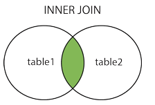
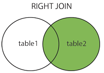

[TOC]


# 前言


# 一、查询语句

```mysql
select  select_list
[from table_list]
[where row_constraint]
[group by grouping_columns]
[order by sorting_columns]
[having group_constraint]
[limit row_count];
```


## 1. 基本查询

```mysql
select user_name from user where id = 1;          
select id,user_name,age from user where id = 1;     -- 查询多个字段
select * from user where id = 1;                    -- 查询全部字段
select distinct user_name from user;                -- 查询不同的字段
```


## 2. 数据过滤

### 2.1 Where 子句操作符


### 2.2 Like


### 2.3 正则表达式


## 3. 联结

当涉及到多表联合查询时，就需要用到联结。

以下面两表为例：

- 数据表t1

```mysql
+-----+-----+
| i1  | c1  |
+-----+-----+
|  1  |  a  | 
|  2  |  b  | 
|  3  |  c  | 
+-----+-----+
```


- 数据表t2

```mysql
+-----+-----+
| i2  | c2  |
+-----+-----+
|  2  |  c  | 
|  3  |  b  | 
|  4  |  a  | 
+-----+-----+
```


### 3.1 交叉联结（cross join）

> 所有表中的所有行互相连接，即笛卡尔积


```mysql 
select * from t1,t2;
select * from t1 cross join t2;     -- 两个语句效果等价
```

以上两个语句效果相同，查询结果如下：

```mysql
+-----+-----+-----+-----+
| i1  | c1  | i2  | c2  |
+-----+-----+-----+-----+
|  1  |  a  |  2  |  c  |  
|  2  |  b  |  2  |  c  |  
|  3  |  c  |  2  |  c  |  
|  1  |  a  |  3  |  b  |  
|  2  |  b  |  3  |  b  |  
|  3  |  c  |  3  |  b  |  
|  1  |  a  |  4  |  a  |  
|  2  |  b  |  4  |  a  |  
|  3  |  c  |  4  |  a  |  
+-----+-----+-----+-----+
```


可以看到 t1表中任一记录与t2表中任一记录两两相关联，这就是交叉联结，也即： **所有表中的所有行互相连接**。

从数学上来说，就是笛卡尔积。

> 假设集合A={a,b}，集合B={0,1,2}，则两个集合的笛卡尔积为{(a,0),(a,1),(a,2),(b,0),(b,1),(b,2)}


从上述语句可以看到，笛卡尔积发生的条件：

> （1）多表查询没有连接条件   
>
> （2）连接条件无效       

​                     

### 3.2 内联结（inner join）

> **结果集中包含两表中同时满足联结条件的记录**


示例：

```mysql
select t1.*,t2.* from t1 inner join t2 on t1.i1=t2.i2;
select t1.*,t2.* from t1，t2 where t1.i1=t2.i2;   -- 两个语句效果等价
```

以上两个语句效果相同，查询结果如下：

```mysql
+-----+-----+-----+-----+
| i1  | c1  | i2  | c2  |
+-----+-----+-----+-----+
|  2  |  b  |  2  |  c  |  
|  3  |  c  |  3  |  b  |  
+-----+-----+-----+-----+
```


效果如下图：




### 3.3 左外联结（left [outer] join）

> 除了包含两表中同时满足联结条件的记录，**还包含左表中不满足联结条件的记录，对应的右表记录用NULL填充**。
>
> 也可理解为：包含左表所有记录，右表不满足联结条件的记录用NULL填充。


示例：

```mysql
select t1.*,t2.* from t1 left [outer] join t2 on t1.i1=t2.i2;
```

查询结果如下：

```mysql
+-----+-----+-----+-----+
| i1  | c1  | i2  | c2  |
+-----+-----+-----+-----+
|  1  |  a  | NULL| NULL|  
|  2  |  b  |  2  |  c  |  
|  3  |  c  |  3  |  b  |  
+-----+-----+-----+-----+
```


效果如下图：


### 3.4 右外联结（right [outer] join）

> 除了包含两表中同时满足联结条件的记录，**还包含右表中不满足联结条件的记录，对应的左表记录用NULL填充**。
>
> 也可理解为：包含右表所有记录，左表不满足联结条件的记录用NULL填充。


示例：

```mysql
select t1.*,t2.* from t1 right [outer] join t2 on t1.i1=t2.i2;
```

查询结果如下：

```mysql
+-----+-----+-----+-----+
| i1  | c1  | i2  | c2  |
+-----+-----+-----+-----+
|  2  |  b  |  2  |  c  |  
|  3  |  c  |  3  |  b  |  
| NULL| NULL|  4  |  a  | 
+-----+-----+-----+-----+
```


效果如下图：




## 4.子查询


## 5.分组


## 6.排序


# 参考资料

1. [Mysql 连接的使用](http://www.runoob.com/mysql/mysql-join.html) 
2. [MySQL（七）联结表](https://www.cnblogs.com/imyalost/p/6407317.html)
3. [Mysql多表查询](http://www.zsythink.net/archives/1105)

