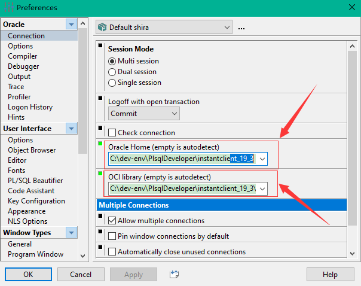

[TOC]


# 前言


# 一、plsql developer 连接Oracle服务端

## 1.下载软件

需要下载两个软件，去官网下载即可

> - `InstantClient`：<https://www.oracle.com/technetwork/cn/database/features/instant-client/index-092699-zhs.html> （下载basic即可）
> - `PL/SQL Developer`: https://www.allroundautomations.com/plsqldev.html


`InstantClient` 下载完解压即可（解压目录后程序所在主目录为Home目录），`PL/SQL Developer`需要安装，默认安装即可（若使用的是PL/SQL Developer绿色版，则解压即可，不用配环境变量）


## 2.配置Oracle的主目录与OCI链接库

（1）游客登录

运行plsqldeveloper，然后登录的时候点击取消，即可游客登录


（2）设置Oracle的主目录与OCI链接库

 依次点击 Configure ->  Preferences -> Oracle -> Connection，然后设置

```properties
Oracle Home = InstantClient Home 目录（路径中不能有中文）
OCI libraray = InstantClient Home 目录\oci.dll
```

我的为：

```properties
Oracle Home = C:\dev-env\PlsqlDeveloper\instantclient_19_3
OCI libraray = C:\dev-env\PlsqlDeveloper\instantclient_19_3\oci.dll
```

如下图所示：




## 3. 配置连接文件`tnsnames.ora`

在 `InstantClient` 的 Home 目录下，创建`network\admin`路径，然后在此路径下创建`tnsnames.ora`，内容如下：

```properties
zyj-hec = 
 (DESCRIPTION =
    (ADDRESS_LIST =
      (ADDRESS = (PROTOCOL = TCP)(HOST = 192.168.12.68)(PORT = 1521 ))
    )
    (CONNECT_DATA =
      (SERVICE_NAME = ORCL)
    )
  )

```

解读：

> - `zyj-hec`：连接名
> - `ADDRESS` ：数据库所在服务器的地址
> - `PROTOCOL`：使用的协议，这里是TCP的 
> - `HOST`:  数据库的主机名或者 `ip`
> - `PORT`：数据库的监听端口
> - `SERVICE_NAME`：SID（服务器服务ID）

## 4.使用用户名密码登录数据库

此时运行 plsql developer ，发现此时Database可以选择`zyj-hec`，也即在`tnsnames.ora`中定义的连接名，然后使用数据库用户名密码登录即可：


## 5.激活

百度一搜一大堆

```properties
PLSQL Developer 13.0.0.1883 注册码
product code： 4vkjwhfeh3ufnqnmpr9brvcuyujrx3n3le 
serial Number：226959 
password: xs374ca
```


## 6.汉化

有需要的可百度搜索：PLSQL Developer 13 汉化包，然后汉化即可

可参考：[PLSQL Developer 13 汉化包](<http://www.zdfans.com/html/26062.html>)


# 参考资料

1. [PL/SQL Developer远程连接数据库](<https://blog.csdn.net/qq_25615395/article/details/79315723>)
2. [PL/SQL远程连接oracle数据库教程](<https://blog.csdn.net/lulidaitian/article/details/77569461>)
3. 


