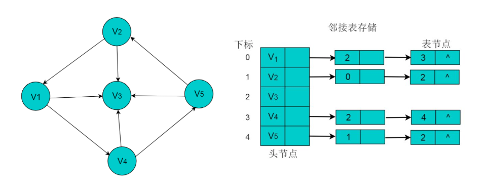

[TOC]


# 前言


# 一、图的基本概念

## 1.图的定义

图 G 由顶点集 V 和边集 E 组成，记为 G = (V , E)

其中：

> - V(G) 表示图G中顶点的有限非空集；E(G)表示图G中顶点之间的关系（边）集合。
> - 若 V={v~1~，v~2~，...，v~n~}，用 `|V|` 表示图G中顶点的个数，也称为图 G 的阶，`E={(u,v)|u∈V，v∈V}`，用 |E| 表示图 G 中边的条数
> - 图的顶点集一定非空


## 2.基本概念


### 2.1 有向图

若 E 是有向边（也称为弧）的有限集合时，则图G为有向图。弧是顶点的有序对，记为`<v,w>` ，其中 v、w是顶点，v称为弧尾，w称为弧头，称为从顶点v到顶点w的弧，也称为v邻接到w，或w邻接自v


### 2.2 无向图


### 2.3 简单图


（4）多重图


（5）完全图（也称简单完全图）


（6）子图


（7）连通、连通图和连通分量


（8）强连通图、强连通分量


（9）生成树、生成森林


（10）顶点的度、入度和出度


（11）边的权和网


（12）稠密图、稀疏图


（13）路径、路径长度和回路


（14）简单路径、简单回路


（15）距离


（16）有向树


# 二、图的存储及基本操作

图的存储必须要完整、准确地反映顶点集和边集的信息，主要的存储方式有两种：邻接矩阵、邻接表

## 1.邻接矩阵

所谓邻接矩阵，就是用一个一维数组存储图中的顶点信息，用一个二维数组存储图中边的信息（即各顶点之间的邻接关系），存储顶点之间邻接关系的二维数组称为邻接矩阵。


结点数为 n 的图 G=(V，E) 的邻接矩阵A是 n*n 的，将 G 的顶点编号为v~1~ ,v~2~ , ... , v~n~ 

- 对于不带权图，若(v~i~ , v~j~)∈E，则 `A[i][j]=1`,否则 `A[i][j]=0`
- 对于带权图，若顶点v~i~ 和 v~j~ 之间有边相连，则邻接矩阵中对应项存放着该边对应的权值，即`A[i][j]`=w~ij~ ；若不相连，则用 ∞ 表示这两个顶点之间不存在边，即 `A[i][j]= ∞`


（1）无向图


（2）有向图


（3）网


## 2.邻接表

当一个图为稀疏图时，使用邻接矩阵表示法显然要浪费大量的存储空间。而图的邻接表法结合了顺序存储和链式存储方法，大大减少了这种不必要的浪费。


所谓邻接表：

- 对图 G 中的每个顶点 v~i~ 建立一个单链表，第 i 个单链表中的结点表示依附于顶点 v~i~ 的边（对于有向图则是以顶点 v~i~ 为尾的弧），这个单链表就称为顶点 v~i~ 的`边表`（对于有向图则称为出边表）
- 边表的头指针和顶点的数据信息采用顺序存储（称为`顶点表`）

因此，在邻接表中存在两种结点：顶点表结点和边表结点


（1）无向图


（2）有向图




# 三、图的遍历

图的遍历是指从图中的某一顶点出发，按照某种搜索方法沿着图中的边对图中的所有顶点访问一次且仅访问一次。


## 1.深度优先搜索

深度优先搜索（Depth-First-Search，DFS），类似于树的先序遍历，它的基本思想是：

- 首先访问图中某一起始顶点 v
- 然后由 v 出发，访问与 v 邻接且未被访问的任一顶点w~1~，接着再访问与w~1~邻接且未被访问的任一顶点 w~2~，.......重复上述过程
- 当不能再继续向下访问时，一次退回到最近被访问的顶点，若它还有邻接顶点未被访问，则从该顶点开始继续上述搜索过程，直到图中所有顶点均被访问过为止。


## 2.广度优先搜索

广度优先搜索（Breadth-First-Search，BFS），类似于二叉树的层序遍历，它的基本思想是：

- 首先访问起始顶点 v
- 接着由 v 出发，依次访问 v 的各个未访问过的邻接顶点 w~1~ ，w~2~，...，w~i~
- 然后再依次访问 w~1~ ，w~2~，...，w~i~ 的所有未被访问过的邻接顶点；
- 再从这些访问过的顶点出发，再访问他们所有未被访问过的邻接顶点......以此类推，直到图中所有顶点都被访问过为止


该算法需借助一个辅助队列，以记住正在访问的顶点的下一层顶点


# 四、图的代码实现

## 1.邻接矩阵表示

无向图的邻接矩阵代码实现如下：

```java
package com.ray.study.datastructure.graph.adjmatrix;

import java.util.ArrayList;
import java.util.LinkedList;

/**
 * 无向图的邻接矩阵表示
 *
 * @author shira 2019/08/21 11:19
 */
public class Graph {
    /**
     * 顶点集
     **/
    private ArrayList<String> vertexList;

    /**
     * 边集(邻接矩阵)
     **/
    private int[][] edges;

    /**
     * 表示边的数目
     **/
    private int sizeOfEdges;

    /**
     * 记录某个顶点是否被访问
     **/
    private boolean[] isVisited;


    public Graph(int n) {
        vertexList = new ArrayList<>(n);
        edges = new int[n][n];
        sizeOfEdges = 0;
    }

    //====================================================
    //  一、图的基本操作
    //====================================================

    /**
     * 1.插入顶点
     *
     * @param vertex 顶点值
     */
    public void insertVertex(String vertex) {
        vertexList.add(vertex);
    }

    /**
     * 2.插入边: (v1,v2)
     *
     * @param v1     第一个顶点的下标
     * @param v2     第二个顶点的下标
     * @param weight 边的权值
     */
    public void insertEdge(int v1, int v2, int weight) {
        edges[v1][v2] = weight;
        edges[v2][v1] = weight;
        sizeOfEdges++;
    }

    public int sizeOfVertex() {
        return vertexList.size();
    }

    public int sizeOfEdge() {
        return sizeOfEdges;
    }

    public String getVertex(int index) {
        return vertexList.get(index);
    }

    public int getWeight(int v1, int v2) {
        return edges[v1][v2];
    }

    /**
     * 7.显示邻接矩阵
     */
    public void showAdjacencyMatrix() {
        for (int[] links : edges) {
            for(int link :links){
                System.out.printf(" %d",link);
            }
            System.out.println();
        }
    }


    //====================================================
    //  二、图的遍历
    //====================================================

    /**
     * 1.深度优先搜索：
     *  可参考树的先根遍历，我们若称图的当前节点为根，则其邻接节点是一个子图
     *   （1）先访问根（当前节点）
     *   （2）访问第一个邻接子图
     *   （3）访问其他邻接子图
     *   （4）访问其他连通分量
     */
    public void dfs(){
        isVisited = new boolean[vertexList.size()];

        //遍历所有的结点，进行dfs[回溯]
        for(int i = 0; i < sizeOfVertex(); i++) {
            // 这一层循环的作用：（1）用于回溯，（2）若无向图是非连通的，进入其他连通分量遍历
            if(!isVisited[i]) {
                dfs(i);
            }
        }
    }


    /**
     * 深度优先搜索
     * 在图中选定起始顶点i，进行图的深度优先搜索
     * @param i 起始顶点i的下标
     */
    private void dfs(int i){
        // 访问节点并设置节点已被访问
        System.out.print(vertexList.get(i));
        isVisited[i] = true;

        //查找节点i的第一个邻接结点j
        int j = getFirstNeighbor(i);

        while(j != -1) {
            // 先访问第一个节点点j
            if(!isVisited[j]) {
                System.out.print("->");
                dfs(j);
            }
            //再访问其兄弟节点
            j = getNextNeighbor(i, j);
        }
    }


    /**
     * 获取邻接矩阵中指定节点的第一个邻接节点的下标
     *
     * @param i 指定节点的下标
     * @return 第一个邻接节点的下标
     */
    public int getFirstNeighbor(int i) {
        for(int j = 0; j < vertexList.size(); j++) {
            if(edges[i][j] > 0) {
                return j;
            }
        }
        return -1;
    }

    /**
     * 根据指定顶点的某一个邻接节点的下标来获取下一个邻接节点
     *
     *   例如边集中有 (v1,v2)、(v1,v3) ,则getNextNeighbor(v1,v2)返回v3
     * @param v1 指定顶点的下标
     * @param v2 指定顶点的某一个邻接节点的下标
     * @return 指定顶点的下一个邻接节点的下标
     */
    public int getNextNeighbor(int v1, int v2) {
        for(int j = v2 + 1; j < vertexList.size(); j++) {
            if(edges[v1][j] > 0) {
                return j;
            }
        }
        return -1;
    }


    /**
     * 2.广度优先搜索
     *    遍历所有结点，都进行广度优先搜索
     */
    public void bfs() {
        isVisited = new boolean[vertexList.size()];

        for(int i = 0; i < sizeOfVertex(); i++) {
            if(!isVisited[i]) {
                bfs(i);
            }
        }
    }

    /**
     * 广度优先搜索
     * @param i  起始顶点的下标
     */
    private void bfs( int i) {
        LinkedList queue = new LinkedList();

        //访问节点，并做已访问标记，然后将其入队
        System.out.print(vertexList.get(i));
        isVisited[i] = true;
        queue.addLast(i);

        int u;
        int w;
        while( !queue.isEmpty()) {
            //取出队列的头结点下标，并获取其第一个邻接节点
            u = (Integer)queue.removeFirst();
            w = getFirstNeighbor(u);
            while(w != -1) {
                // 先访问第一个邻接节点
                if(!isVisited[w]) {
                    System.out.print("->"+getVertex(w));
                    isVisited[w] = true;
                    queue.addLast(w);
                }
                //以u为前驱点，找w后面的下一个邻结点
                //体现广度优先
                w = getNextNeighbor(u, w);
            }
        }
    }


    public static void main(String[] args) {
        // 顶点集
        String vertexs[] = {"1", "2", "3", "4", "5", "6", "7", "8"};

        // 构建图
        Graph graph = new Graph(vertexs.length);

        //添加顶点
        for (String vertex : vertexs) {
            graph.insertVertex(vertex);
        }

        //添加边
        graph.insertEdge(0, 1, 1);
        graph.insertEdge(0, 2, 1);
        graph.insertEdge(1, 3, 1);
        graph.insertEdge(1, 4, 1);
        graph.insertEdge(3, 7, 1);
        graph.insertEdge(4, 7, 1);
        graph.insertEdge(2, 5, 1);
        graph.insertEdge(2, 6, 1);
        graph.insertEdge(5, 6, 1);

        // 显示邻接矩阵
        graph.showAdjacencyMatrix();

        // 深度优先搜索
        graph.dfs();
        System.out.println();
        graph.bfs();
    }

}

```


# 五、图的应用

## 1.最小生成树


# 参考资料

1. [数据结构与算法——图论基础与图存储结构](https://www.itcodemonkey.com/article/13876.html)
2. [数据结构和算法学习笔记：图论](http://www.yeolar.com/note/2012/05/30/ds-graph/)
3. [Graph and its representations](https://www.geeksforgeeks.org/graph-and-its-representations/)
4. 


