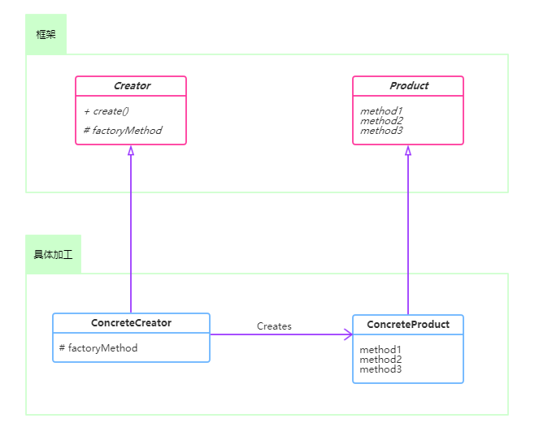
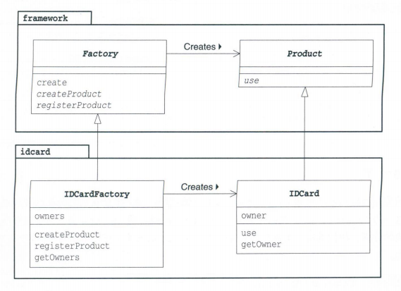

# 一、前言
上一节，我们学习了简单工厂模式，
这一节，我们来看下工厂方法模式。


# 二、基本概念
## 1. 定义
> Factory Method
### 1.1 标准定义
> 此定义来自《设计模式之禅》

定义一个创建对象的接口，让实现类来决定实例化哪一个类，工厂方法使一个类的实例化延迟到其子类。

> Define an interface for creating an object, but let subclasses decide which class to instantiate.Factory Method lets a class defer instantiation to subclasses.

### 1.2 精简定义
> 此定义来自《图解设计模式》

用 Template Method 模式来构建生成实例的工厂，这就是 Factory Method 模式。

在 Factory Method 模式中，父类决定了实例的生成方式，但是并不决定所要生成的具体的类，具体的处理交给子类负责，这样就可以将生成实例的框架和实际负责生成实例的类解耦。

## 2.适用场景
（1）工厂方法模式是new一个对象的替代品，所以在所有需要生成对象的地方都可以使用，但是需要慎重地考虑是否要增加一个工厂类进行管理，增加代码的复杂度。

（2）需要灵活的、可扩展的框架时，可以考虑采用工厂方法模式。

（3）工厂方法模式可以用在异构项目中。

（4）可以使用在测试驱动开发的框架下。


## 3.优劣
- 优点
  （1）良好的封装性，代码结构清晰。
  （2）加入新产品符合开闭原则，提高可扩展性
  （3）屏蔽产品类。用户只需要关心所需产品对应的工厂，无须关心创建细节。
  （4）工厂方法模式是典型的解耦框架。高层模块值需要知道产品的抽象类，其他的实现类都不用关心，符合迪米特法则，我不需要的就不要去交流；也符合依赖倒置原则，只依赖产品类的抽象；当然也符合里氏替换原则，使用产品子类替换产品父类，没问题！

- 弊端
  （1）类的个数容易过多，增加复杂度
  （2）增加了系统的抽象性和理解难度

## 4.登场角色



其中具体工厂和具体产品可以有多个。


### 4.1 Product（产品）
Product 是一个抽象类，定义了在 Factory Method 模式中生成的实例所需要实现的接口，具体的处理则由子类 ConcreteProduct 决定。

### 4.2 Creator（创建者）
Creator 是负责生成 Product 角色的抽象类，具体的处理由子类决定。
Creator 中的 create 方法相当于 Template Method 模式中的模型方法，实现了生成实例的过程，factoryMethod 则是需要子类实现的方法。

### 4.3 ConcreteProduct（具体产品）
ConcreteProduct 决定了具体的产品

### 4.4 ConcreteCreator（具体创建者）
ConcreteCreator 负责生成具体的产品


# 三、代码实例
来看一个制作身份证的示例

## 1. 类图



Product 类和 Factory 类属于framework包，这两个类，组成了生成实例的框架。
IDCard 类和 IDCardFactory 类负责实际的加工处理，他们属于idcard包

## 2.代码
### 2.1 Product 

```java
public abstract class Product {
    public abstract void use();
}
```
### 2.2 Factory
这里使用 Template Method 模式，用create方法定义了创建产品的流程。
该类还声明了用于 "生成产品" 的 createProduct 抽象方法和用于 "注册产品" 的 registerProduct抽象方法。
```java
public abstract class Factory {
    public final Product create(String owner) {
        Product p = createProduct(owner);
        registerProduct(p);
        return p;
    }

    protected abstract Product createProduct(String owner);

    protected abstract void registerProduct(Product product);
}
```

### 2.3 IDCard

```java
public class IDCard extends Product {
    private String owner;

    public IDCard(String owner) {
        System.out.println("制作" + owner + "的ID卡");
        this.owner = owner;
    }

    @Override
    public void use() {
        System.out.println("使用" + owner + "的ID卡");
    }

    public String getOwner() {
        return owner;
    }
}
```

### 2.4 IDCardFactory

```java
public class IDCardFactory extends Factory {
    private List<String> owers = new ArrayList<>();

    @Override
    protected Product createProduct(String owner) {
        return new IDCard(owner);
    }

    @Override
    protected void registerProduct(Product product) {
        owers.add(((IDCard) product).getOwner());
    }

    public List<String> getOwers() {
        return owers;
    }
}
```

### 2.5 Main
测试类

```java
public class Main {
    public static void main(String[] args) {
        Factory factory = new IDCardFactory();
        Product card1 = factory.create("小明");
        Product card2 = factory.create("小红");
        Product card3 = factory.create("小刚");
        card1.use();
        card2.use();
        card3.use();
    }
}
```


## 3.实现 createProduct 方法的三种方式
（1）定义为抽象方法，子类必须实现
（2）通过构造方法，但是不能再将超类定义为抽象类 
（3）在超类 create 方法抛出异常，子类如果不重写此方法，就会抛出异常，无法运行。

# 四、相关的设计模式
### 1.Template Method 模式
Factory Method 模式是 Template Method 模式的典型应用。
在示例程序中，create 方法就是模板方法

### 2.Singleton 模式
可以将 Singleton 模式用于扮演 Creator 或 ConcreteCreaor 角色，在场景中不需要有多个 Creator。

### 3.Iterator 模式
在 Iterator 模式中生成 iterator 可以使用 Factory Method 模式。

### 4.Composite 模式
可以将 Composite 模式用于 Product 角色


# 四、源码分析


# 五、参考资料
1. [CyC2018/CS-Notes](https://github.com/CyC2018/CS-Notes/blob/master/notes/%E8%AE%BE%E8%AE%A1%E6%A8%A1%E5%BC%8F.md) 
2. [quanke/design-pattern-java-source-code](https://github.com/quanke/design-pattern-java-source-code)
3. [图说设计模式](https://design-patterns.readthedocs.io/zh_CN/latest/)
4. [图解设计模式-CSDN-wujunyucg](https://blog.csdn.net/wujunyucg/article/category/7301352/1)