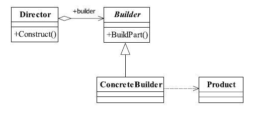

# 一、前言

建造者模式（BuilderPattern）也叫做生成器模式


# 二、基本概念
## 1.定义
### 1.1 标准定义

将一个复杂对象的构建与它的表示分离，使得同样的构建过程可以创建不同的表示。

> Separate the construction of a complex object from its representation so that the same construction process can create different representations.


### ~~1.2 精简定义~~


## 2.适用场景

（1）相同的方法，不同的执行顺序，产生不同的事件结果时，可以采用建造者模式。

（2）多个部件或零件，都可以装配到一个对象中，但是产生的运行结果又不相同时，则可以使用该模式

（3）产品类非常复杂，或者产品类中的调用顺序不同产生了不同的效能，这个时候使用建造者模式非常合适。

（4）在对象创建过程中会使用到系统中的一些其他对象，这些对象在产品对象的创建过程中不易得到时，也可以采用建造者模式封装该对象的创建过程。该种场景只能是一个补偿方法，因为一个对象不容易获得，而在设计阶段竟然没有发觉，而要通过创建者模式柔化创建过程，本身已经违反设计的最初目标。


## 3.优劣

### 3.1 优点


- 封装性

    使用建造者模式可以使客户端不必知道产品内部组成的细节，


- 建造者独立，容易扩展


- 便于控制细节风险

    由于具体的建造者是独立的，因此可以对建造过程逐步细化，而不对其他的模块产生任何影响。


## 4.登场角色




### 4.1 Product（产品类）

通常是实现了模板方法模式，也就是有模板方法和基本方法。


### 4.2 Builder（抽象建造者）

规范产品的组建，一般是由子类实现。


定义生成实例的接口


### 4.3 ConcreteBuilder（具体建造者）

实现抽象类定义的所有方法，并且返回一个组建好的对象。


### 4.4 Director（导演类）

负责安排已有模块的顺序，然后告诉Builder开始建造。

导演类起到封装的作用，避免高层模块深入到建造者内部的实现类。当然，在建造者模式比较庞大时，导演类可以有多个。


# 三、代码实例

车辆模型实例


## 1.产品类

- CarModel (抽象产品)

```java

/**
 * @author cbf4Life cbf4life@126.com
 * I'm glad to share my knowledge with you all.
 * 定义一个车辆模型的抽象类，所有的车辆模型都继承这里类
 */
public abstract class CarModel {
	
	//这个参数是各个基本方法执行的顺序
	private ArrayList<String> sequence = new ArrayList<String>();
	
	/*
	 * 模型是启动开始跑了
	 */
	protected abstract void start();
	
	//能发动，那还要能停下来，那才是真本事
	protected abstract void stop();
	
	//喇叭会出声音，是滴滴叫，还是哔哔叫
	protected abstract void alarm();
	
	//引擎会轰隆隆的响，不响那是假的
	protected abstract void engineBoom();
	
	//那模型应该会跑吧，别管是人推的，还是电力驱动，总之要会跑
	final public void run() {
		
		//循环一边，谁在前，就先执行谁
		for(int i=0;i<this.sequence.size();i++){
			String actionName = this.sequence.get(i);
			
			if(actionName.equalsIgnoreCase("start")){  //如果是start关键字，
				this.start();  //开启汽车
			}else if(actionName.equalsIgnoreCase("stop")){ //如果是stop关键字
				this.stop(); //停止汽车   
			}else if(actionName.equalsIgnoreCase("alarm")){ //如果是alarm关键字
				this.alarm(); //喇叭开始叫了
			}else if(actionName.equalsIgnoreCase("engine boom")){  //如果是engine boom关键字
				this.engineBoom();  //引擎开始轰鸣
			}
					
		}
		
	}
	
	//把传递过来的值传递到类内
	final public void setSequence(ArrayList<String> sequence){
		this.sequence = sequence;
	}
}
```


-  BMWModel （具体产品）

```java

/**
 * @author cbf4Life cbf4life@126.com
 * I'm glad to share my knowledge with you all.
 * 宝马车模型
 */
public class BMWModel extends CarModel {


	@Override
	protected void alarm() {
		System.out.println("宝马车的喇叭声音是这个样子的...");
	}


	@Override
	protected void engineBoom() {
		System.out.println("宝马车的引擎室这个声音的...");
	}


	@Override
	protected void start() {
		System.out.println("宝马车跑起来是这个样子的...");
	}


	@Override
	protected void stop() {
		System.out.println("宝马车应该这样停车...");
	}

}

```


- BenzModel（具体产品）


```java
/**
 * @author cbf4Life cbf4life@126.com
 * I'm glad to share my knowledge with you all.
 * 奔驰车模型
 */
public class BenzModel extends CarModel {


   @Override
   protected void alarm() {
      System.out.println("奔驰车的喇叭声音是这个样子的...");
   }


   @Override
   protected void engineBoom() {
      System.out.println("奔驰车的引擎室这个声音的...");
   }


   @Override
   protected void start() {
      System.out.println("奔驰车跑起来是这个样子的...");
   }


   @Override
   protected void stop() {
      System.out.println("奔驰车应该这样停车...");
   }

}
```


## 2.建造者

- CarBuilder（抽象建造者）

```java
/**
 * @author cbf4Life cbf4life@126.com
 * I'm glad to share my knowledge with you all.
 * 要什么顺序的车，你说，我给建造出来
 */
public abstract class CarBuilder {
   
   //建造一个模型，你要给我一个顺序要，就是组装顺序
   public abstract void setSequence(ArrayList<String> sequence);
   
   //设置完毕顺序后，就可以直接拿到这个这两模型
   public abstract CarModel getCarModel();
}
```


- BMWBuilder（具体建造者）

```java
/**
 * @author cbf4Life cbf4life@126.com
 * I'm glad to share my knowledge with you all.
 * 给定一个顺序，返回一个宝马车
 */
public class BMWBuilder extends CarBuilder {
   private BMWModel bmw = new BMWModel();
   
   @Override
   public CarModel getCarModel() {
      return this.bmw;
   }

   @Override
   public void setSequence(ArrayList<String> sequence) {
      this.bmw.setSequence(sequence);
   }

}
```


- BenzBuilder（具体建造者）

```java
/**
 * @author cbf4Life cbf4life@126.com
 * I'm glad to share my knowledge with you all.
 * 各种设施都给了，我们按照一定的顺序制造一个奔驰车
 */
public class BenzBuilder extends CarBuilder {
   private BenzModel benz = new BenzModel();

   @Override
   public CarModel getCarModel() {
      return this.benz;
   }


   @Override
   public void setSequence(ArrayList<String> sequence) {
      this.benz.setSequence(sequence);
   }

}
```


## 3.导演类

```java
/**
 * @author cbf4Life cbf4life@126.com
 * I'm glad to share my knowledge with you all.
 * 导演安排顺序，生产车辆模型
 */
public class Director {
   private ArrayList<String> sequence = new ArrayList<String>();
   private BenzBuilder benzBuilder = new BenzBuilder();
   private BMWBuilder bmwBuilder = new BMWBuilder();
   
   /*
    * A类型的奔驰车模型，先start,然后stop,其他什么引擎了，喇叭一概没有
    */
   public BenzModel getABenzModel(){
      //清理场景，这里是一些初级程序员不注意的地方
      this.sequence.clear();
      
      //这只ABenzModel的执行顺序
      this.sequence.add("start");
      this.sequence.add("stop");
      
      //按照顺序返回一个奔驰车
      this.benzBuilder.setSequence(this.sequence);
      return (BenzModel)this.benzBuilder.getCarModel();
      
   }
   
   /*
    * B型号的奔驰车模型，是先发动引擎，然后启动，然后停止，没有喇叭
    */
   public BenzModel getBBenzModel(){
      this.sequence.clear();
      
      this.sequence.add("engine boom");
      this.sequence.add("start");
      this.sequence.add("stop");
      
      this.benzBuilder.setSequence(this.sequence);
      return (BenzModel)this.benzBuilder.getCarModel();
   }
   
   /*
    * C型号的宝马车是先按下喇叭（炫耀嘛），然后启动，然后停止
    */
   public BMWModel getCBMWModel(){
      this.sequence.clear();
      
      this.sequence.add("alarm");
      this.sequence.add("start");
      this.sequence.add("stop");
      
      this.bmwBuilder.setSequence(this.sequence);
      return (BMWModel)this.bmwBuilder.getCarModel();
   }
   
   /*
    * D类型的宝马车只有一个功能，就是跑，启动起来就跑，永远不停止，牛叉
    */
   public BMWModel getDBMWModel(){
      this.sequence.clear();
      
      this.sequence.add("start");
      
      this.bmwBuilder.setSequence(this.sequence);
      return (BMWModel)this.benzBuilder.getCarModel();
   }
   
   /*
    * 这边很可以有很多方法，你可以先停止，然后再启动，或者一直停着不动，静态的嘛
    * 导演类嘛，按照什么顺序是导演说了算
    */
}
```


## 4.Client

```java
/**
 * @author cbf4Life cbf4life@126.com
 * I'm glad to share my knowledge with you all.
 * 这里是牛叉公司的天下，他要啥我们给啥
 */
public class Client {

   public static void main(String[] args) {
      Director director = new Director();
      
      //1W辆A类型的奔驰车
      for(int i=0;i<10000;i++){
         director.getABenzModel().run();
      }
      
      //100W辆B类型的奔驰车
      for(int i=0;i<1000000;i++){
         director.getBBenzModel().run();
      }
      
      //1000W量C类型的宝马车
      for(int i=0;i<10000000;i++){
         director.getCBMWModel().run();
      }
   }

}
```


# 四、相关设计模式

## 1.模板方法模式


## 2.工厂方法模式


# 五、源码分析

# 六、参考资料
1. [CyC2018/CS-Notes](https://github.com/CyC2018/CS-Notes/blob/master/notes/%E8%AE%BE%E8%AE%A1%E6%A8%A1%E5%BC%8F.md) 
2. [quanke/design-pattern-java-source-code](https://github.com/quanke/design-pattern-java-source-code)
3. [图说设计模式](https://design-patterns.readthedocs.io/zh_CN/latest/)
4. [图解设计模式-CSDN-wujunyucg](https://blog.csdn.net/wujunyucg/article/category/7301352/1)