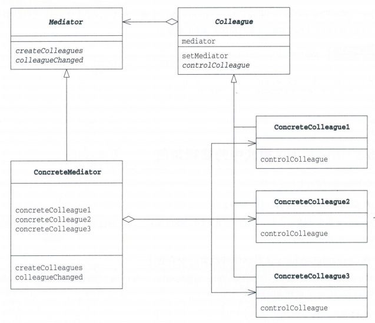

[TOC]

# 一、前言

# 二、基本概念
## 1.定义

用一个中介对象封装一系列的对象交互，中介者使各对象不需要显示地相互作用，从而使其耦合松散，而且可以独立地改变它们之间的交互.

> Define an object that encapsulates how a set of objects interact.Mediator promotes loose coupling by keeping objects from referring to each other explicitly, and it lets you vary their interaction independently.

## 2.适用场景

中介者模式适用于**多个对象之间紧密耦合**的情况，紧密耦合的标准是：在类图中出现了蜘蛛网状结构。

使用终结者模式可将蜘蛛网状结构梳理为星型结构。

实际例子:

- 机场调度中心
- MVC
- 媒体网关
- 中介服务

## 3.优劣

### 3.1 优点

- 减少类间的依赖

把原有的一对多的依赖变成了一对一的依赖，同事类只依赖中介者，减少了依赖，当然同时也降低了类间的耦合。

### 3.2 缺点

- 中介者会膨胀得很大

中介者模式的缺点就是中介者会膨胀得很大，而且逻辑复杂，原本N个对象直接的相互依赖关系转换为中介者和同事类的依赖关系，同事类越多，中介者的逻辑就越复杂。

## 4.登场角色

### 4.1 Mediator（抽象中介者）

负责定义与 Colleague 角色进行通信和做出决定的接口。

> 定义统一的接口，用于各同事角色之间的通信。

### 4.2 Concrete Mediator（具体中介者）

具体中介者 通过协调各同事角色实现协作行为，因此它必须依赖于各个同事角色。

### 4.3 Colleague（同事）

负责定义与 Mediator 角色进行通信的接口。

> 每一个同事角色都知道中介者角色，而且与其他的同事角色通信的时候，一定要通过中介者角色协作。

### 4.4 Concrete Colleague（具体同事）

负责实现 Colleague 接口。

# 三、代码实例

# 四、相关设计模式

# 五、源码分析

# 六、参考资料
1. [CyC2018/CS-Notes](https://github.com/CyC2018/CS-Notes/blob/master/notes/%E8%AE%BE%E8%AE%A1%E6%A8%A1%E5%BC%8F.md) 
2. [quanke/design-pattern-java-source-code](https://github.com/quanke/design-pattern-java-source-code)
3. [图说设计模式](https://design-patterns.readthedocs.io/zh_CN/latest/)
4. [图解设计模式-CSDN-wujunyucg](https://blog.csdn.net/wujunyucg/article/category/7301352/1)