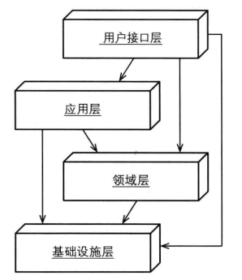

# 一、前言

在领域驱动设计的分层架构中，可分为如下层面

- 用户界面层
- 应用层
- 领域层
- 基础设施层

若更细致的划分：

- **用户界面层**
    - 数据传输对象
    - 领域负载对象
- **应用层**
    - 应用服务
- **领域层**
    - 领域模型
        - 实体
        - 值对象
    - 领域服务
- **基础设施层**

# 二、DDD分层架构实例

模块命名：顶级域名 -> 组织或公司的域名 -> 限界上下文 -> 分层

com.alibaba.order

- 

# 三、基础设施层

# 四、领域层

## 1.领域模型

### 1.1 实体

状态可变、拥有唯一标识。

### 1.2 值对象

状态不变、

值对象可以用于存放实体的唯一标识。值对象是不变的，这可以保证实体身份的稳定性。

## 2.领域服务

### 2.1 职责

处理业务逻辑

# 五、应用层

## 1.应用服务

应用服务扮演协调者角色，主要职责如下：

- 控制持久化事务
- 安全认证
- 发送消息、邮件
- 协调领域服务
- 是表达用例和用户故事的主要手段
- 

# 六、用户界面层

## 1.职责

用户界面主要处理：

- 用户显示和用户请求
- 数据校验：校验用户输入

用户显示和用户请求：如何将领域对象渲染到用户界面的显示中？反之，如何将用户操作反映到领域模型上？

## 2.渲染领域对象

用户界面通常需要渲染多个聚合实例中的属性。

按照展现层是否在远程，可分为：

- DTO
- DPO

### 2.1 渲染数据传输对象（DTO）

一种渲染多个聚合实例方法便是使用数据传输对象（Data Tranfer Object，DTO）。

DTO将包含需要显示的所有属性值。

DTO模式是用于在远程的展现层（如前端页面）中显示数据的。

### 2.2 通过领域负载对象渲染聚合实例

在没有必要使用DTO时，可以将多个聚合实例中需要显示的数据汇集到一个领域负载对象（Domain Payload Object，DPO）中。

