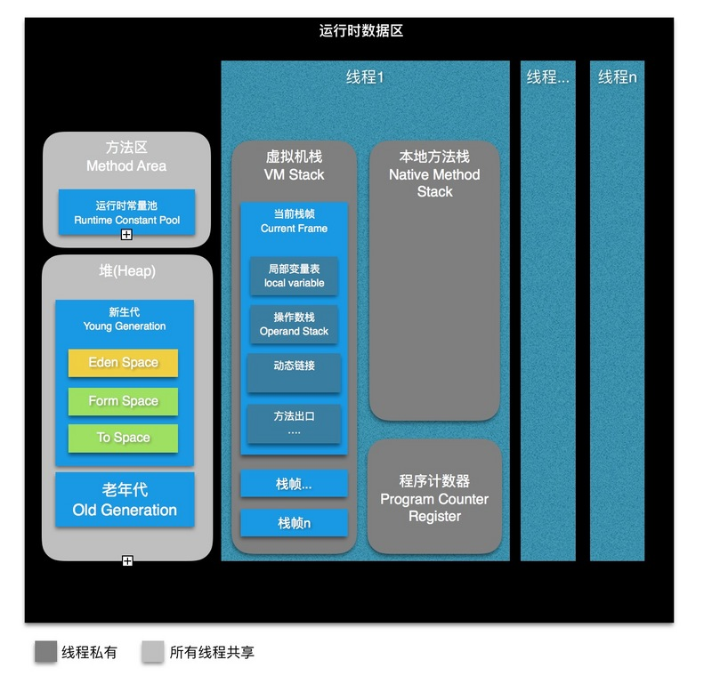
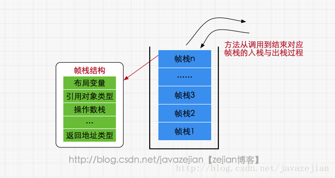

[TOC]

# 前言

根据《Java虚拟机规范（JavaSE7版）》的规定，Java虚拟机所管理的内存将会包括以下几个运行时数据区域：

| 序号 | 区域       | 线程私有 | 存储信息                                       |
| ---- | ---------- | -------- | ---------------------------------------------- |
| 1    | 程序计数器 | 是       | 行号指示器                                     |
| 2    | 虚拟机栈   | 是       | 栈帧：局部变量表、操作数栈、动态链接、方法出口 |
| 3    | 本地方法栈 | 是       | 为Native方法服务                               |
| 4    | 堆         | 否       | 对象实例                                       |
| 5    | 方法区     | 否       | 类信息、常量、静态变量、运行时常量池、代码     |

# 一、程序计数器

> **Program Counter Register**

## 1.行号指示器

程序计数器（ProgramCounterRegister）是一块较小的内存空间，它可以看作是当前线程所执行的字节码的行号指示器。

> 在虚拟机的概念模型里（仅是概念模型，各种虚拟机可能会通过一些更高效的方式去实现），字节码解释器工作时就是通过改变这个计数器的值来选取下一条需要执行的字节码指令，分支、循环、跳转、异常处理、线程恢复等基础功能都需要依赖这个计数器来完成。

## 2.线程私有

由于Java虚拟机的多线程是通过线程轮流切换并分配处理器执行时间的方式来实现的，在任何一个确定的时刻，一个处理器（对于多核处理器来说是一个内核）都只会执行一条线程中的指令。

因此，为了线程切换后能恢复到正确的执行位置，每条线程都需要有一个独立的程序计数器，各条线程之间计数器互不影响，独立存储，我们称这类内存区域为“线程私有”的内存。

## 3.异常

- 如果线程正在执行的是一个Java方法，这个计数器记录的是正在执行的虚拟机字节码指令的地址；

- 如果正在执行的是Native方法，这个计数器值则为空（Undefined）。

此内存区域是唯一一个在Java虚拟机规范中没有规定任何OutOfMemoryError情况的区域。

# 二、虚拟机栈

> **Java Virtual Machine Stacks**

## 1.线程私有

虚拟机栈是线程私有的，其生命周期与线程相同。

## 2.存储

###  2.1 栈帧

虚拟机栈描述的是Java方法执行的内存模型：

- 每个方法在执行的同时都会创建一个栈帧（StackFrame）用于存储**局部变量表**、**操作数栈**、**动态链接**、**方法出口**等信息。

- 每一个方法从调用直至执行完成的过程，就对应着一个栈帧在虚拟机栈中入栈到出栈的过程。

### 2.2 局部变量表

局部变量表存放了编译期可知的

- 各种基本数据类型（boolean、byte、char、short、int、float、long、double）
- 对象引用（reference类型，它不等同于对象本身，可能是一个指向对象起始地址的引用指针，也可能是指向一个代表对象的句柄或其他与此对象相关的位置）
- returnAddress 类型（指向了一条字节码指令的地址）。

### 2.3 局部变量表大小

> 其中64位长度的long和double类型的数据会占用2个局部变量空间（Slot），其余的数据类型只占用1个。

局部变量表所需的内存空间**在编译期间完成分配**，当进入一个方法时，这个方法需要在帧中分配多大的局部变量空间是完全确定的，在方法运行期间不会改变局部变量表的大小。

## 3.异常

在Java虚拟机规范中，对这个区域规定了两种异常状况：

- 如果线程请求的栈深度大于虚拟机所允许的深度，将抛出`StackOverflowError`异常；

- 如果虚拟机栈可以动态扩展（当前大部分的Java虚拟机都可动态扩展，只不过Java虚拟机规范中也允许固定长度的虚拟机栈），如果扩展时无法申请到足够的内存，就会抛出`OutOfMemoryError`异常。

# 三、本地方法栈

> **Native Method Stack**

## 1.为Native方法服务

本地方法栈（NativeMethodStack）与虚拟机栈所发挥的作用是**非常相似**的，它们之间的区别不过是：

- 虚拟机栈为虚拟机执行Java方法（也就是字节码）服务
- 而本地方法栈则为虚拟机使用到的Native方法服务。

## 2.自由实现

在虚拟机规范中对本地方法栈中方法使用的语言、使用方式与数据结构并没有强制规定，因此具体的虚拟机可以**自由实现**它。

甚至有的虚拟机（譬如SunHotSpot虚拟机）直接就把本地方法栈和虚拟机栈合二为一。

## 3.异常

与虚拟机栈一样，本地方法栈区域也会抛出StackOverflowError和OutOfMemoryError异常。

# 四、Java堆

> **Java Heap**

## 1.线程共享

Java堆是被所有线程共享的一块内存区域，在虚拟机启动时创建。

## 2. 存储

### 2.1 内存最大

对于大多数应用来说，Java堆（JavaHeap）是Java虚拟机所管理的内存中最大的一块。

### 2.2 存放对象实例

此内存区域的唯一目的就是存放对象实例，几乎所有的对象实例都在这里分配内存。

这一点在Java虚拟机规范中的描述是：所有的对象实例以及数组都要在堆上分配[1]。

> 但是随着JIT编译器的发展与逃逸分析技术逐渐成熟，**栈上分配**、**标量替换**[2]优化技术将会导致一些微妙的变化发生，所有的对象都分配在堆上也渐渐变得不是那么“绝对”了。

### 2.3 垃圾回收

Java堆是垃圾收集器管理的主要区域，因此很多时候也被称做“GC堆”。

- 从内存回收的角度来看

> 由于现在收集器基本都采用分代收集算法，所以Java堆中还可以细分为：**新生代**和**老年代**；再细致一点的有**Eden**空间、**FromSurvivor**空间、**ToSurvivor**空间等。

- 从内存分配的角度来看

>  线程共享的Java堆中可能划分出多个线程私有的分配缓冲区（ThreadLocalAllocationBuffer,TLAB）。

不过无论如何划分，都与存放内容无关，无论哪个区域，存储的都仍然是对象实例，进一步划分的目的是为了更好地回收内存，或者更快地分配内存。

### 2.4 逻辑连续

根据Java虚拟机规范的规定，Java堆可以处于物理上不连续的内存空间中，只要逻辑上是连续的即可。

在实现时，既可以实现成固定大小的，也可以是可扩展的，不过当前主流的虚拟机都是按照可扩展来实现的（通过-Xmx和-Xms控制）。

## 3.异常

如果在堆中没有内存完成实例分配，并且堆也无法再扩展时，将会抛出OutOfMemoryError异常。

# 五、方法区

## 1.线程共享

线程共享，在虚拟机启动时创建。

## 2.存储

用于存储已被虚拟机加载的**类信息**、**常量**、**静态变量**、即时编译器编译后的**代码**等数据。

类信息：

- 类的版本
- 字段
- 方法
- 接口

##  3.垃圾回收

Java虚拟机规范对方法区的限制非常宽松，除了和Java堆一样不需要连续的内存和可以选择固定大小或者可扩展外，还**可以选择不实现垃圾收集**。

相对而言，垃圾收集行为在这个区域是比**较少出现**的，但并非数据进入了方法区就如永久代的名字一样“永久”存在了。

这区域的内存回收目标主要是针对**常量池的回收**和对**类型的卸载**，一般来说，这个区域的回收“成绩”比较难以令人满意，尤其是类型的卸载，条件相当苛刻，但是这部分区域的回收确实是必要的。在Sun公司的BUG列表中，曾出现过的若干个严重的BUG就是由于低版本的HotSpot虚拟机对此区域未完全回收而导致内存泄漏

## 4.异常

根据Java虚拟机规范的规定，当方法区无法满足内存分配需求时，将抛出OutOfMemoryError异常。

## 5.常量池

运行时常量池（RuntimeConstantPool）是方法区的一部分。

Class文件常量池：存放编译期生成的**字面量**和**符号引用**

> Class文件中除了有类的版本、字段、方法、接口等描述信息外，还有一项信息是常量池（ConstantPoolTable），用于存放编译期生成的各种字面量和符号引用，这部分内容将在类加载后进入方法区的运行时常量池中存放。

运行时常量池：运行期间也可以将新的常量放入池中（动态性）。

> 运行时常量池相对于Class文件常量池的另外一个重要特征是具备**动态性**，Java语言并不要求常量一定只有编译期才能产生，也就是并非预置入Class文件中常量池的内容才能进入方法区运行时常量池，运行期间也可能将新的常量放入池中，这种特性被开发人员利用得比较多的便是**String类的intern()方法**。

# 六、直接内存

## 1.本机直接内存

直接内存（DirectMemory）并不是虚拟机运行时数据区的一部分，也不是Java虚拟机规范中定义的内存区域，

而是本机的直接内存

## 2.堆外内存

 DirectByteBuffer ->  堆外内存：

>  在JDK1.4中新加入了NIO（NewInput/Output）类，引入了一种基于通道（Channel）与缓冲区（Buffer）的I/O方式，它可以使用Native函数库直接分配**堆外内存**，然后通过一个存储在Java堆中的**DirectByteBuffer**对象作为这块内存的引用进行操作。这样能在一些场景中显著提高性能，因为避免了在Java堆和Native堆中来回复制数据。

## 3.异常

显然，本机直接内存的分配不会受到Java堆大小的限制，但是，既然是内存，肯定还是会受到**本机总内存**（包括RAM以及SWAP区或者分页文件）**大小**以及**处理器寻址空间**的限制。

服务器管理员在配置虚拟机参数时，会根据实际内存设置-Xmx等参数信息，但经常忽略直接内存，使得各个内存区域总和大于物理内存限制（包括物理的和操作系统级的限制），从而导致动态扩展时出现OutOfMemoryError异常。

# 七、参考资料

1. [Java内存区域与Java内存模型](https://blog.csdn.net/calledwww/article/details/79368966#commentBox)
2. [jvm 运行时数据区](https://segmentfault.com/a/1190000006051731)
3. 