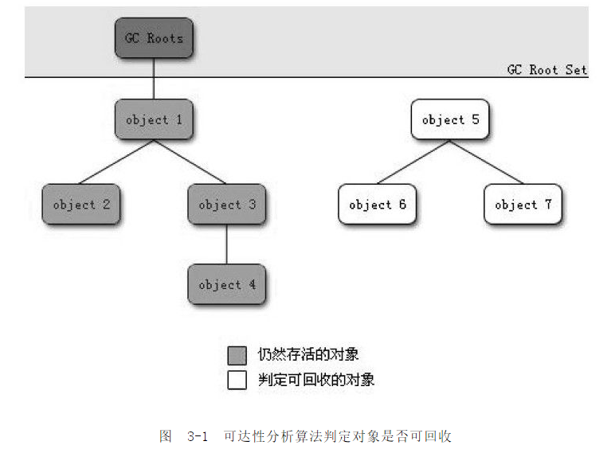
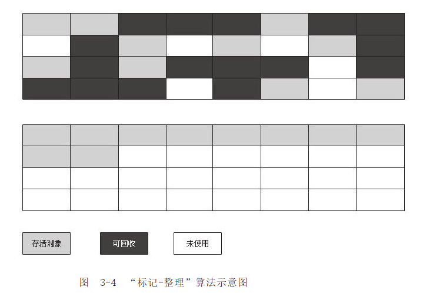

[TOC]

# 前言

为啥需要了解垃圾回收：

> 当需要排查各种内存溢出、内存泄漏问题时，当垃圾收集成为系统达到更高并发量的瓶颈时，我们就需要对这些“自动化”的技术实施必要的监控和调节。

JVM内存的哪些区域需要进行回收：

>线程共享的区域：Java 堆、方法区

从哪些方面了解垃圾回收：

> - 如何判定对象是否存活
> - 如何回收
> - 何时回收

# 一、对象存活判定算法

## 1. 引用计数法

### 1.1 基本思路

给对象中添加一个引用计数器，每当有一个地方引用它时，计数器值就加1；当引用失效时，计数器值就减1；任何时刻计数器为0的对象就是不可能再被使用的。

### 1.2 存在问题

很难解决**对象间循环引用**问题

## 2. 可达性分析算法

### 2.1 基本思路

通过一系列的称为"GCRoots"的对象作为起始点，从这些节点开始向下搜索，搜索所走过的路径称为引用链（ReferenceChain），当一个对象到GCRoots没有任何引用链相连（用图论的话来说，就是从GCRoots到这个对象不可达）时，则证明此对象是不可用的。

### 2.2 GC Roots

Java中，可作为GC Roots 的对象包括：

- 虚拟机栈（栈帧中的本地变量表）中引用的对象。
- 方法区中类静态属性引用的对象。
- 方法区中常量引用的对象。
- 本地方法栈中JNI（即一般说的Native方法）引用的对象。

## 3. 再谈引用

（1）传统狭义引用

> 无论是通过引用计数算法判断对象的引用数量，还是通过可达性分析算法判断对象的引用链是否可达，判定对象是否存活都与“引用”有关。
>
> 在JDK1.2以前，Java中的引用的定义很传统：

如果reference类型的数据中存储的数值代表的是另外一块内存的起始地址，就称这块内存代表着一个引用。

（2）为什么要扩展狭义引用

> 这种定义很纯粹，但是太过狭隘，一个对象在这种定义下只有**被引用**或者**没有被引用**两种状态，对于如何描述一些“食之无味，弃之可惜”的对象就显得无能为力。我们希望能描述这样一类对象：**当内存空间还足够时，则能保留在内存之中；如果内存空间在进行垃圾收集后还是非常紧张，则可以抛弃这些对象**。

（3）引用扩充

> 在JDK1.2之后，Java对引用的概念进行了扩充，将引用分为强引用（Strong Reference）、软引用（Soft Reference）、弱引用（Weak Reference）、虚引用（Phantom Reference）4种，这4种引用强度依次逐渐减弱。

以判刑为例

- 强引用

    > （ 无罪释放 )
    >
    > 指在程序代码之中普遍存在的，类似"Objectobj=newObject()"这类的引用，只要强引用还存在，垃圾收集器**永远不会回收**掉被引用的对象。

- 软引用

    > （ 延后问斩）
    >
    > 软引用是用来描述一些还有用但并非必需的对象。
    >
    > 对于软引用关联着的对象，在系统**将要发生内存溢出异常之前**，将会把这些对象列进回收范围之中进行第二次回收。如果这次回收还没有足够的内存，才会抛出内存溢出异常。

- 弱引用

    > （秋后问斩）
    >
    > 弱引用也是用来描述非必需对象的，但是它的强度比软引用更弱一些，被弱引用关联的对象只能生存到**下一次垃圾收集发生之前**。当垃圾收集器工作时，无论当前内存是否足够，都会回收掉只被弱引用关联的对象。

- 虚引用

    > （幽灵引用）
    >
    > 虚引用也称为幽灵引用或者幻影引用，它是最弱的一种引用关系。
    >
    > 一个对象是否有虚引用的存在，完全不会对其生存时间构成影响，也无法通过虚引用来取得一个对象实例。
    >
    > 为一个对象设置虚引用关联的唯一目的就是能在这个对象被收集器回收时收到一个系统通知。在JDK1.2之后，提供了PhantomReference类来实现虚引用。

## 4. 两次标记过程

两次标记时的筛选条件：

（1）此对象是否有必要执行finalize()方法

（2）在finalize()中是否与与引用链上的对象建立关联

在可达性分析算法中不可达的对象，它的垃圾回收，至少要经历两次标记过程：

> - 如果对象在进行可达性分析后发现没有与GCRoots相连接的引用链，那它将会**被第一次标记并且进行一次筛选，筛选的条件是此对象是否有必要执行finalize()方法**。当对象没有覆盖finalize()方法，或者finalize()方法已经被虚拟机调用过，虚拟机将这两种情况都视为“没有必要执行”。
> - 如果这个对象被判定为有必要执行finalize()方法，那么这个对象将会放置在一个叫做F-Queue的队列之中，并在稍后由一个由虚拟机自动建立的、低优先级的Finalizer线程去执行它。这里所谓的“执行”是指虚拟机会触发这个方法，但并不承诺会等待它运行结束，这样做的原因是，如果一个对象在finalize()方法中执行缓慢，或者发生了死循环（更极端的情况），将很可能会导致F-Queue队列中其他对象永久处于等待，甚至导致整个内存回收系统崩溃。finalize()方法是对象逃脱死亡命运的最后一次机会，稍后GC将**对F-Queue中的对象进行第二次小规模的标记，如果对象要在finalize()中成功拯救自己——只要重新与引用链上的任何一个对象建立关联即可**，譬如把自己（this关键字）赋值给某个类变量或者对象的成员变量，那在第二次标记时它将被移除出“即将回收”的集合；如果对象这时候还没有逃脱，那基本上它就真的被回收

注意：

> 作者建议不要使用 finalize() 方法，建议忘掉 Java 语言中有这个方法的存在。
>

## 5. 回收方法区

（1）可以不进行垃圾回收，因为效率低

Java虚拟机规范中确实说过可以不要求虚拟机在方法区实现垃圾收集，而且在方法区中进行垃圾收集的“性价比”一般比较**低**。

（2）垃圾收集

- 回收常量

- 类型卸载

    > 类需要同时满足下面3个条件才能算是“无用的类”：
    >
    > - 该类所有的**实例**都已经被回收，也就是Java堆中不存在该类的任何实例。
    > - 加载该类的**ClassLoader**已经被回收。
    > - 该类对应的java.lang.**Class对象**没有在任何地方被引用，无法在任何地方通过反射访问该类的方法

（3）控制类的回收

> 虚拟机可以对满足上述3个条件的无用类进行回收，这里说的仅仅是“可以”，而并不是和对象一样，不使用了就必然会回收。是否对类进行回收，HotSpot虚拟机提供了-Xnoclassgc参数进行控制，还可以使用-verbose:class以及-XX:+TraceClassLoading、-XX:+TraceClassUnLoading查看类加载和卸载信息，其中-verbose:class和-XX:+TraceClassLoading可以在Product版的虚拟机中使用，-XX:+TraceClassUnLoading参数需要FastDebug版的虚拟机支持。

（4）最佳实践

在大量使用反射、动态代理、CGLib等ByteCode框架、动态生成JSP以及OSGi这类频繁自定义ClassLoader的场景都需要虚拟机具备类卸载的功能，以保证永久代不会溢出。

# 二、垃圾收集算法

## 1.标记—清除算法

最基础的收集算法，后续算法都是对其的改进。

### 1.1 基本思路

算法分为“标记”和“清除”两个阶段：

（1）标记

标记出所有需要回收的对象。标记过程就是前面提到的两次标记过程。

（2）清除

在标记完成后统一回收所有被标记的对象

### 1.2 不足

（1）效率不高

（2）产生大量空间碎片

## 2.复制算法

解决了 标记-清除算法 的效率问题。

### 2.1 基本思路

将可用内存按容量划分为大小相等的两块，每次只使用其中的一块。

当这一块的内存用完了，就将还存活着的对象复制到另外一块上面，然后再把已使用过的内存空间一次清理掉。

### 2.1 优劣

（1）优点

使得每次都是对整个半区进行内存回收，内存分配时也就不用考虑内存碎片等复杂情况，只要移动堆顶指针，按顺序分配内存即可，实现简单，运行高效。

（2）缺点

可用内存降低为原来的一半

### 2.3 新生代

 （1）新生代垃圾回收过程

现在的商业虚拟机都采用这种收集算法来回收新生代，IBM公司的专门研究表明，新生代中的对象98%是“朝生夕死”的，所以并不需要按照1:1的比例来划分内存空间，而是将内存分为一块较大的Eden空间和两块较小的Survivor空间，每次使用Eden和其中一块Survivor[1]。当回收时，将Eden和Survivor中还存活着的对象一次性地复制到另外一块Survivor空间上，最后清理掉Eden和刚才用过的Survivor空间。

HotSpot虚拟机默认Eden和Survivor的大小比例是8:1，也就是每次新生代中可用内存空间为整个新生代容量的90%（80%+10%），只有10%的内存会被“浪费”。当然，98%的对象可回收只是一般场景下的数据，我们没有办法保证每次回收都只有不多于10%的对象存活，当Survivor空间不够用时，需要依赖其他内存（这里指老年代）进行分配担保（HandlePromotion）。

（2）分配担保

如果另外一块Survivor空间没有足够空间存放上一次新生代收集下来的存活对象时，这些对象将直接通过分配担保机制进入老年代。

## 3.标记—整理算法

复制收集算法在对象存活率较高时就要进行较多的复制操作，效率将会变低。这种特点适用于新生代而不适用于老年代。

### 3.1 基本思路

标记过程仍然与“标记-清除”算法一样，但后续步骤不是直接对可回收对象进行清理，而是让所有存活的对象都向一端移动，然后直接清理掉端边界以外的内存。

## 4.分代收集算法

当前商业虚拟机的垃圾收集都采用“分代收集”（GenerationalCollection）算法

这种算法并没有什么新的思想，只是根据对象存活周期的不同将内存划分为几块。

### 1.基本思路

一般是把Java堆分为新生代和老年代，这样就可以根据各个年代的特点采用最适当的收集算法。

- 在新生代中，每次垃圾收集时都发现有大批对象死去，只有少量存活，那就选用**复制算法**，只需要付出少量存活对象的复制成本就可以完成收集。
- 而老年代中因为对象存活率高、没有额外空间对它进行分配担保，就必须使用“标记—清理”或者“**标记—整理**”算法来进行回收。

# 三、HotSpot 的算法实现

待续

# 四、参考资料

1. [Java虚拟机：JVM内存分代策略](https://www.cnblogs.com/fangfuhai/p/7206944.html)
2. [java中分代思想](https://blog.csdn.net/yinbucheng/article/details/72807079)
3. [分代的垃圾回收策略](https://www.cnblogs.com/tuifeideyouran/p/4587867.html)