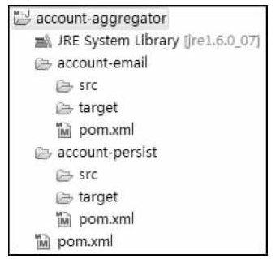

# 一、前言

在进行项目开发时，我们通常会对项目进行模块化划分，这样一个项目被划分为多个模块。


# 二、聚合

通过聚合，我们可以一次构建多个模块。

## 1.布局方式

聚合模块通常是一个POM工程，项目布局方式有两种：分层布局和水平布局


### 1.1 分层布局




```xml
<project>  
    <modelVersion>4.0.0</modelVersion>  
   
    <groupId>com.juvenxu.mvnbook.account</groupId>  
    <artifactId>account-aggregator</artifactId>  
    <version>1.0.0-SNAPSHOT</version>  
    <packaging> pom </packaging>  

    <name>Account Aggregator</name> 
     
    <modules>  
        <module>account-email</module>  
        <module>account-persist</module>  
    </modules>  
</project>
```

在POM工程下，通过 `module`元素可以声明此POM所包含的模块


### 1.2 水平布局


```xml
<project>  
    <modelVersion>4.0.0</modelVersion>  
   
    <groupId>com.juvenxu.mvnbook.account</groupId>  
    <artifactId>account-aggregator</artifactId>  
    <version>1.0.0-SNAPSHOT</version>  
    <packaging> pom </packaging>  

    <name>Account Aggregator</name> 
     
    <modules>  
        <module>../account-email</module>  
        <module>../account-persist</module>  
    </modules>  
</project>
```


## 2.项目构建过程

若在聚合模块下执行 `mvn clean install` ，	则项目构建过程：

- 首先解析聚合模块的POM、分析要构建的模块、并计算出一个反应堆构建顺序（ReactorBuildOrder）
- 然后根据这个顺序依次构建各个模块。


>  反应堆是所有模块组成的一个构建结构。


# 三、继承

> **Maven的继承与JAVA中的继承，思想一致。**

通过聚合，我们可以使用一条命令构建多个模块。然而多模块下，还会存在依赖、插件重复定义的问题，而这可以通过继承来解决。


通过继承，我们可以集中管理整个项目下多个模块依赖、插件的版本以及项目的GroupId，一定程度上消除重复。


## 1.声明继承

### 1.1 父POM

父POM模块需要声明为一个POM工程，来供子模块继承

```xml
<project>  
    <modelVersion>4.0.0</modelVersion>  
    
    <groupId>com.juvenxu.mvnbook.account</groupId>  
    <artifactId> account-parent </artifactId>  
    <version>1.0.0-SNAPSHOT</version>  
    <packaging>pom</packaging>  
    <name>Account Parent</name>  
    
</project>
```

在实际项目中，一个POM工程，既可以是聚合POM ，又可以是父POM 


### 1.2 子模块

```xml
<project>  
    <modelVersion>4.0.0</modelVersion>  
      
    < parent >  
        <groupId>com.juvenxu.mvnbook.account</groupId>  
        <artifactId> account-parent </artifactId>  
        <version>1.0.0-SNAPSHOT</version>  
        < relativePath >../account-parent/pom.xml</ relativePath>  
    </ parent >  
      
    <artifactId> account-email </artifactId>  
    <name>Account Email</name>  
  ...  
</project>
```


- parent : 父模块
- relativePath ：父模块POM的相对路径


> 当项目构建时，Maven会首先根据relativePath检查父POM，如果找不到，再从本地仓库查找。
>
> relativePath的默认值是../pom.xml，也就是说，Maven默认父POM在上一层目录下（分层布局）。


子模块隐式地从父模块继承 `groupId`、`version `这两个元素，


## 2.可继承的POM元素

| 元素                    | 含义                                                         |
| ----------------------- | ------------------------------------------------------------ |
| groupId                 | 项目组 ID ，项目坐标的核心元素                               |
| version                 | 项目版本，项目坐标的核心元素                                 |
| description             | 项目的描述信息                                               |
| organization            | 项目的组织信息                                               |
| inceptionYear           | 项目的创始年份                                               |
| url                     | 项目的 url 地址                                              |
| developers              | 项目的开发者信息                                             |
| contributors            | 项目的贡献者信息                                             |
| distributionManagerment | 项目的部署信息                                               |
| issueManagement         | 缺陷跟踪系统信息                                             |
| ciManagement            | 项目的持续继承信息                                           |
| scm                     | 项目的版本控制信息                                           |
| mailingLists            | 项目的邮件列表信息                                           |
| properties              | 自定义的 Maven 属性                                          |
| dependencies            | 项目的依赖配置                                               |
| dependencyManagement    | 醒目的依赖管理配置                                           |
| repositories            | 项目的仓库配置                                               |
| build                   | 包括项目的源码目录配置、输出目录配置、插件配置、插件管理配置等 |
| reporting               | 包括项目的报告输出目录配置、报告插件配置等                   |


## 3.依赖管理

- 在父POM中  使用 `dependencyManagement` 元素来声明依赖，并统一管理依赖的版本

- 子模块使用这些依赖时就无需声明版本

> `dependencyManagement` 元素中只是对依赖进行声明，而并未真正使用依赖。要使用依赖需要借助根元素project下的`dependencies`元素。


### 3.1 父POM依赖管理

```xml
<project>  
    <modelVersion>4.0.0</modelVersion>  
    
    <groupId>com.juvenxu.mvnbook.account</groupId>  
    <artifactId> account-parent </artifactId>  
    <version>1.0.0-SNAPSHOT</version>  
    <packaging>pom</packaging>  
    <name>Account Parent</name>  
    
    <properties>
        <jackson.version>2.8.8</jackson.version>
    </properties>

    <dependencyManagement>
        <dependencies>
                <!-- jackson -->
                <dependency>
                    <groupId>com.fasterxml.jackson.core</groupId>
                    <artifactId>jackson-core</artifactId>
                    <version>${jackson.version}</version>
                </dependency>
                <dependency>
                    <groupId>com.fasterxml.jackson.core</groupId>
                    <artifactId>jackson-databind</artifactId>
                    <version>${jackson.version}</version>
                </dependency>
                <dependency>
                    <groupId>com.fasterxml.jackson.core</groupId>
                    <artifactId>jackson-annotations</artifactId>
                    <version>${jackson.version}</version>
                </dependency>
        </dependencies>
    </dependencyManagement>
</project>
```


### 3.2 子模块使用依赖

子模块可继承父模块声明的依赖信息，使用父模块声明的依赖时无需依赖的声明版本

```xml
<project>  
    <modelVersion>4.0.0</modelVersion>  
      
    < parent >  
        <groupId>com.juvenxu.mvnbook.account</groupId>  
        <artifactId> account-parent </artifactId>  
        <version>1.0.0-SNAPSHOT</version>  
        < relativePath >../account-parent/pom.xml</ relativePath>  
    </ parent >  
      
    <artifactId> account-email </artifactId>  
    <name>Account Email</name>  

    <dependencies>
        <!-- jackson -->
        <dependency>
            <groupId>com.fasterxml.jackson.core</groupId>
            <artifactId>jackson-core</artifactId>
        </dependency>
        <dependency>
            <groupId>com.fasterxml.jackson.core</groupId>
            <artifactId>jackson-databind</artifactId>
        </dependency>
        <dependency>
            <groupId>com.fasterxml.jackson.core</groupId>
            <artifactId>jackson-annotations</artifactId>
        </dependency>
    </dependencies>
    
</project>
```


## 4.插件管理

使用元素可以

- 在父POM中  使用  `pluginManagement` 元素来声明插件以及插件的行为
- 子模块使用这些插件时就无需声明版本以及定义行为了


> 在该元素中配置的依赖不会造成实际的插件调用行为，当POM中配置了真正的 plugin元素，并且其 groupId和 artifactId与 pluginManagement中配置的插件匹配时， pluginManagement的配置才会影响实际的插件行为.


### 4.1 父POM插件管理

当项目中的多个模块有同样的插件配置时，应当将配置移到父POM的 `pluginManagement` 元素中。

```xml
    <build>
        <pluginManagement>
            <plugins>
                <plugin>
                    <groupId>org.apache.maven.plugins</groupId>
                    <artifactId>maven-compiler-plugin</artifactId>
                    <version>3.6.0</version>
                    <configuration>
                        <source>1.8</source>
                        <target>1.8</target>
                        <encoding>UTF-8</encoding>
                    </configuration>
                </plugin>
                <plugin>
                    <groupId>org.apache.maven.plugins</groupId>
                    <artifactId>maven-surefire-plugin</artifactId>
                    <version>2.18.1</version>
                    <configuration>
                        <skipTests>true</skipTests>
                    </configuration>
                </plugin>
                <plugin>
                    <!-- if including source jars, use the no-fork goals
                         otherwise both the Groovy sources and Java stub sources
                         will get included in your jar -->
                    <groupId>org.apache.maven.plugins</groupId>
                    <artifactId>maven-source-plugin</artifactId>
                    <!-- source plugin \> = 2.1 is required to use the no-fork goals -->
                    <version>2.4</version>
                    <executions>
                        <execution>
                            <id>attach-sources</id>
                            <phase>verify</phase>
                            <goals>
                                <goal>jar-no-fork</goal>
                                <goal>test-jar-no-fork</goal>
                            </goals>
                        </execution>
                    </executions>
                </plugin>
            </plugins>
        </pluginManagement>
    </build>
```


- maven-compiler-plugin ：针对 compile 生命周期，指定源码和输出class的java版本，以及字符编码

- maven-surefire-plugin ： 针对 test 生命周期，指定跳过单元测试
- maven-source-plugin ：针对  verity 生命周期，指定生成项目源码包


### 4.2 子模块使用插件

```xml
    <build>
        <plugins>
            <plugin>
                <groupId>org.apache.maven.plugins</groupId>
                <artifactId>maven-compiler-plugin</artifactId>
            </plugin>
            <plugin>
                <groupId>org.apache.maven.plugins</groupId>
                <artifactId>maven-surefire-plugin</artifactId>
            </plugin>
            <plugin>
                <groupId>org.apache.maven.plugins</groupId>
                <artifactId>maven-source-plugin</artifactId>
            </plugin>
        </plugins>
    </build>
```


- 若子模块需要使用父POM中声明的插件，则可以直接使用 `groupId`、`artifactId`来引用。

- 若子模块需要不同配置的插件，则可以自行配置以覆盖父POM所声明的配置。
- 若子模块不需要父POM声明的插件，忽略即可。


# 四、反应堆

## 1.反应堆构建顺序

- Maven按序读取POM，如果该POM没有依赖模块，那么就构建该模块，

- 否则就先构建其依赖模块，

- 如果该依赖还依赖于其他模块，则进一步先构建依赖的依赖。


> 模块间的依赖关系会将反应堆构成一个有向非循环图（Directed Acyclic Graph，DAG），各个模块是该图的节点，依赖关系构成了有向边。这个图不允许出现循环，因此，当出现模块A依赖于B，而B又依赖于A的情况时，Maven就会报错。


## 2.裁剪反应堆

有时，用户需要实时地裁剪反应堆：

>  一般来说，用户会选择构建整个项目或者选择构建单个模块，但有些时候，用户会想要仅仅构建完整反应堆中的某些个模块。


Maven提供很多的命令行选项支持裁剪反应堆，输入 `mvn -h` 可以看到这些选项：

> - -am 
>     - --also-make同时构建所列模块的依赖模块
> - -amd  
>     - --also-make-dependents同时构建依赖于所列模块的模块
> - -pl
>     - --projects<arg>构建指定的模块，模块间用逗号分隔
> - -rf
>     - --resume-from<arg>从指定的模块回复反应堆


