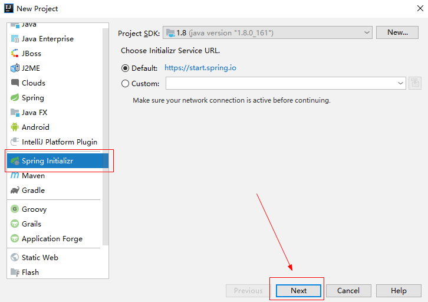
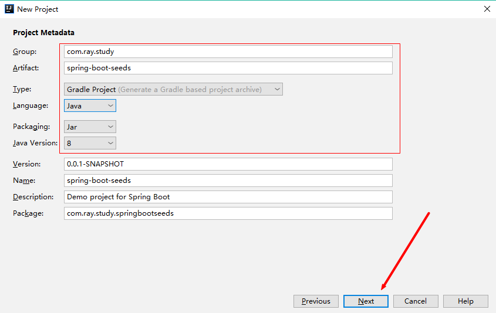
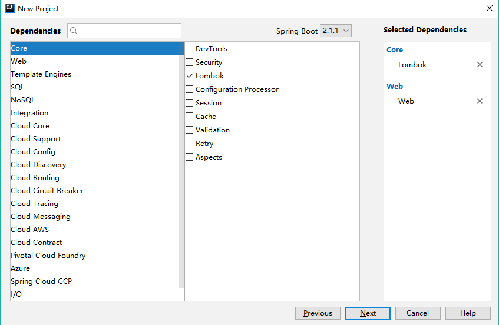
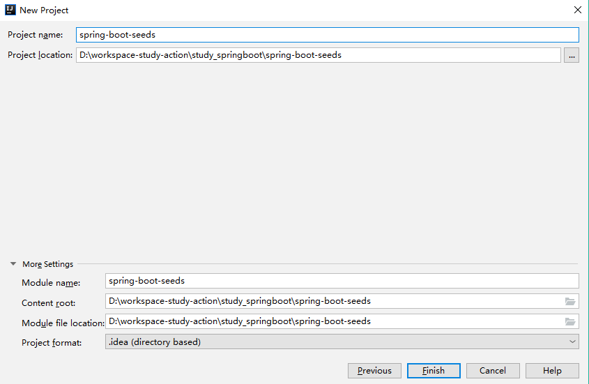
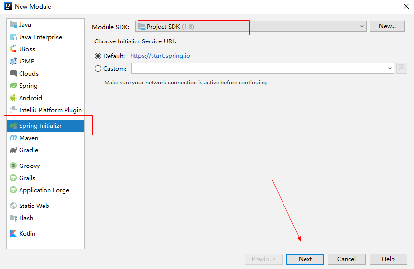
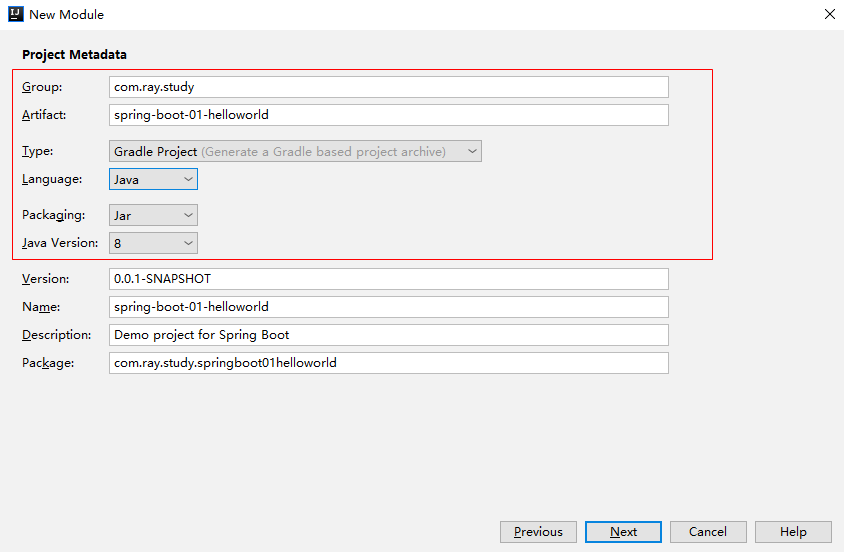
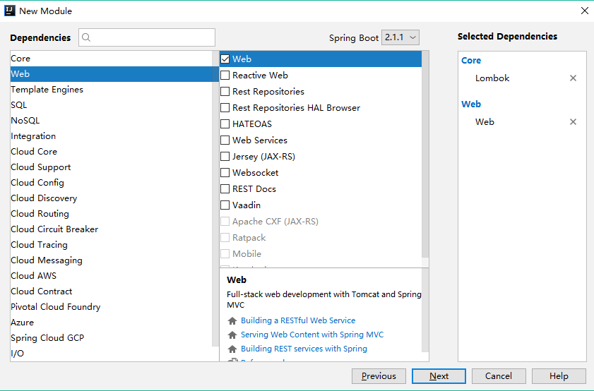
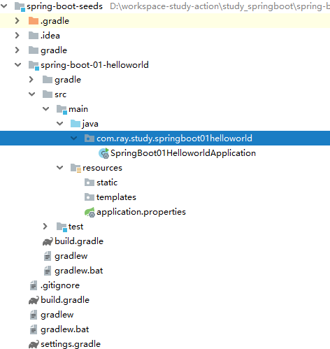
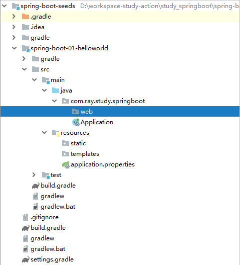

[TOC]


# 一、前言

这一节我们将开始总结springboot的相关知识，这一节我们将来通过一个入门小示例来了解springboot的快速开发。


# 二、简介
## 1.设计目的
> `简化 Spring 应用的初始搭建以及开发过程`

- Spring Boot其设计目的是用来简化 Spring 应用的初始搭建以及开发过程。

- Spring Boot 的目标不在于为已解决的问题域提供新的解决方案，而是为平台带来另一种开发体验，从而简化对这些已有技术的使用。

- Spring Boot 充分利用了 `JavaConfig 的配置模式`以及`“约定优于配置”的理念`，能够极大的简化基于 Spring MVC 的 Web 应用和 REST 服务开发。对于已经熟悉 Spring 生态系统的开发人员来说，Spring Boot 是一个很理想的选择。

## 2.优点
> - 为所有Spring开发者`更快的入门`
> - `开箱即用`：提供各种默认配置来简化项目配置
> - `内嵌式容器`简化Web项目
> - JavaConfig：`没有冗余代码生成和XML配置的要求`

这将使得`编码`、`配置`、`部署`、`监控`变得更简单。


# 三、环境准备

本文的环境信息：

java：1.8

springboot :  2


# 四、父项目准备

在开始实战前，我们先来创建一个父项目来管理此系列教程的其他项目。

## 1.创建父项目

### 1.1 New Project

打开Idea  ->  File -> New -> Project...  -> Spring Initializr ，选择JDK版本，然后Next





### 1.2 Project Metadata





### 1.3 Dependencies





### 1.4 Location

设置项目路径





### 1.5 Import Moudule from Gradle

直接点击OK，选择默认推荐的gradle wrapper


## 2.父项目变动

### 2.1 删除src目录

父项目主要管理公共依赖，没有源码，因此删除掉src目录。


### 2.2 build.gradle

修改build.gradle文件，将文件内容替换为如下内容，此文件是项目构建文件，类似Maven的pom.xml文件。

```groovy
buildscript {
    ext {
        springBootVersion = '2.1.4.RELEASE'
    }
    repositories {
        maven { url 'http://maven.aliyun.com/nexus/content/groups/public/' }
        mavenCentral()
    }
    dependencies {
        classpath("org.springframework.boot:spring-boot-gradle-plugin:${springBootVersion}")
    }
}


//配置所有项目
allprojects {
    //公共插件插件
    apply plugin: 'java'

    //公共属性
    group = 'com.ray.study'
    version = '0.0.1-SNAPSHOT'

    //编译版本
    sourceCompatibility = 1.8
    targetCompatibility = 1.8

}

//构建依赖
subprojects {

    //应用插件
    apply plugin: 'org.springframework.boot'
    apply plugin: 'io.spring.dependency-management'

    repositories {
        maven { url 'http://maven.aliyun.com/nexus/content/groups/public/' }
    }

    configurations {
        compileOnly {
            extendsFrom annotationProcessor
        }
    }

    dependencies {
        implementation 'org.springframework.boot:spring-boot-starter-web'
        testImplementation 'org.springframework.boot:spring-boot-starter-test'

        compileOnly 'org.projectlombok:lombok'
        annotationProcessor 'org.projectlombok:lombok'
    }
}

repositories {
    maven { url 'http://maven.aliyun.com/nexus/content/groups/public/' }

}


```


# 五、实战

- 入门级HelloWorld

下面我们将创建一个Spring Boot基础项目，并实现一个简单的Http请求处理，由此来体会 SpringBoot 给我们带来的快速开发体验。


## 1.创建项目

此过程与上面创建父项目类似

### 1.1 New Moudle

父项目右键 -> New ->  Moudle  -> Spring Initializr ，选择JDK版本，然后Next





### 1.2 Project Metadata





### 1.3 Dependencies

选择依赖，其实这里可以不用选择依赖，因为父项目已经有了这两个依赖，直接继承就好了。




### 1.4 Location

设置项目位置


### 1.5 Import Moudule from Gradle

直接点击OK，选择默认推荐的gradle wrapper


## 2.父子结构

### 2.1 父项目 settings.gradle

项目包含的子项目是在` settings.gradle `中声明的，

```groovy
rootProject.name = 'spring-boot-seeds'
include 'spring-boot-01-helloworld'
```

上述代码的作用：

> 声明根项目为`spring-boot-seeds` ，并且包含子模块`spring-boot-01-helloworld`


### 2.2 子项目 settings.gradle

由于 spring-boot-01-helloworld  项目并不包含子项目，因此可以删除掉 setting.gradle


### 2.3 子项目 build.gradle

由于在父项目中已声明了依赖，因此此文件内容可清空。


## 3.重构项目结构

自动生成的项目结构如下：




将其改为下图：





## 4.引入HelloWorld服务

在`com.ray.study.springboot.web`包下创建 HelloController 类，内容如下：


```java
package com.ray.study.springboot.web;

import org.springframework.web.bind.annotation.RequestMapping;
import org.springframework.web.bind.annotation.RestController;

/**
 * @desc
 *
 * @author shirayner
 * @date 2018/12/4
 */

@RestController
public class HelloController {

	@RequestMapping("/hello")
	public String index() {
		return "Hello World";
	}

}

```


## 5.启动项目

SpringBoot项目启动有如下几种方式

### 5.1 Java Application

由于 Application类是有main方法的，因此直接像运行普通 Java 程序一样运行它就好了


### 5.2 gradlew bootRun

在项目根目录执行

```perl
./gradlew bootRun
```


### 5.3 java -jar

先执行如下命令，编译并打包项目

```./gradlew  build
./gradlew build
```


然后使用如下命令运行jar包

```
java -jar 
```


## 6.访问项目

浏览器访问地址：

> [http://localhost:8080/hello](http://localhost:8080/hello)


可看到下图


